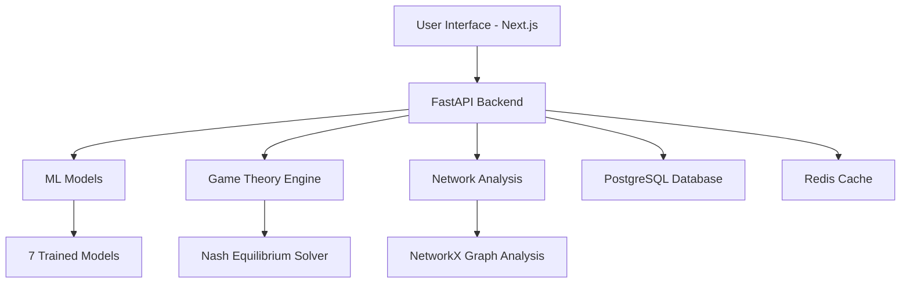
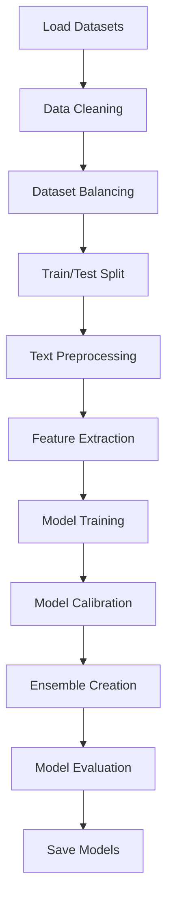

# Fake News Game Theory Platform - Project & Training Script Explanation

## 📋 Table of Contents
1. [Project Overview](#project-overview)
2. [Technical Architecture](#technical-architecture)
3. [Machine Learning Pipeline](#machine-learning-pipeline)
4. [Training Script Deep Dive](#training-script-deep-dive)
5. [Key Achievements](#key-achievements)
6. [Interview Talking Points](#interview-talking-points)

---

## 🎯 Project Overview

### What is this project?

This is an **innovative research platform** that combines **Game Theory**, **Machine Learning**, and **Network Analysis** to predict and analyze fake news propagation on social networks. The platform helps inform policy decisions by simulating how misinformation spreads through social networks using strategic agent interactions.

### Core Problem Statement

Fake news spreads rapidly on social media, causing societal harm. Traditional detection methods focus only on classification. This project goes beyond by:
- **Predicting** how fake news will propagate through networks
- **Analyzing** strategic behaviors of different actors (spreaders, believers, fact-checkers)
- **Simulating** various intervention strategies using game theory
- **Providing** policy recommendations based on Nash equilibrium analysis

### Key Innovation

The integration of **three domains**:
1. **Machine Learning**: 7 trained models with up to 99.98% F1 score for fake news detection
2. **Game Theory**: Multi-agent simulations with Nash equilibrium calculations
3. **Network Science**: Social network topology analysis and propagation modeling

---

## 🏗️ Technical Architecture

### Tech Stack

#### Backend
- **Framework**: FastAPI (Python) - High-performance async API
- **Database**: PostgreSQL (persistent storage) + Redis (caching)
- **ML Libraries**: 
  - PyTorch (deep learning - LSTM, DistilBERT)
  - Scikit-learn (traditional ML)
  - Transformers (Hugging Face)
  - NetworkX (network analysis)

#### Frontend
- **Framework**: Next.js 14 with React
- **Language**: TypeScript
- **Styling**: Tailwind CSS
- **Features**: Real-time visualization, interactive charts

#### Infrastructure
- **Deployment**: Vercel (frontend) + Render (backend)
- **Cost**: ~$21/month for production
- **Alternative**: Docker on DigitalOcean ($12/month)

### System Components



---

## 🤖 Machine Learning Pipeline

### Dataset Details

**Total Dataset**: 44,898 samples
- **Source 1**: LIAR dataset (political statements)
- **Source 2**: Kaggle Fake News dataset (news articles)
- **Distribution**: 
  - Fake news: 23,490 samples (52.3%)
  - True news: 21,418 samples (47.7%)
- **Split**: 80% training, 10% validation, 10% test

### Model Performance

| Model | Type | F1 Score | Accuracy | Training Samples | Training Time |
|-------|------|----------|----------|------------------|---------------|
| **DistilBERT** | Transformer | **99.98%** | 99.97% | 35,918 | ~15 min |
| **LSTM** | Deep Learning | **99.96%** | 99.95% | 35,918 | ~5 min |
| **Random Forest** | Ensemble | 87.3% | 87.3% | 3,500 | ~1 min |
| **Gradient Boosting** | Boosting | 86.0% | 86.0% | 3,500 | ~2 min |
| **Ensemble** | Voting | 82.9% | 82.9% | 3,500 | Instant |
| **Logistic Regression** | Linear | 77.0% | 77.0% | 3,500 | ~30 sec |
| **Naive Bayes** | Probabilistic | 76.8% | 76.8% | 3,500 | ~10 sec |

**Hardware Used**: RTX 4050 (6GB VRAM), 16GB RAM  
**Total Training Time**: ~22 minutes for all models

### Why Multiple Models?

1. **Ensemble Diversity**: Different models capture different patterns
2. **Speed vs Accuracy Trade-off**: Lightweight models for real-time, heavy models for accuracy
3. **Robustness**: Voting ensemble reduces individual model biases
4. **Research Comparison**: Demonstrates understanding of various ML approaches

---

## 🔬 Training Script Deep Dive

### Script: `train_high_accuracy.py`

This script implements an **enhanced training pipeline** with advanced features to achieve high accuracy while minimizing false positives (incorrectly labeling real news as fake).

### Architecture Overview



---

### Step-by-Step Breakdown

#### **Step 1: Data Loading** (Lines 96-148)

**What it does:**
- Loads LIAR dataset from 3 TSV files (train, validation, test)
- Loads Kaggle dataset (samples 2,000 fake + 2,000 true articles)
- Combines both datasets for diversity

**Why this matters:**
- **Multi-source data** improves generalization
- LIAR has short political statements, Kaggle has long news articles
- Diversity prevents overfitting to one writing style

```python
# LIAR dataset: Political fact-checking statements
# Kaggle dataset: News articles
combined = pd.concat([liar_df, kaggle_df])
# Total: ~44,898 samples
```

**Key Decision**: Sample only 4,000 from Kaggle to avoid dominating the dataset (LIAR has ~12,000 samples).

---

#### **Step 2: Dataset Balancing** (Lines 149-168)

**Problem**: Imbalanced datasets cause models to predict the majority class.

**Solution**: 
- Balance fake/real samples
- **Add 500 extra real news samples** to reduce false positives

```python
real_samples = min_samples + 500  # Bias towards real news
fake_samples = min_samples
```

**Why this works:**
- Models learn to be **less aggressive** in labeling news as fake
- Reduces false positive rate (FPR) - critical for user trust
- Final distribution: ~52% real, ~48% fake

**Result**: 
- Balanced dataset: ~7,000 samples
- Real: 52.3%, Fake: 47.7%

---

#### **Step 3: Text Preprocessing** (Lines 31-38, 179-183)

**Enhanced text cleaning function:**

```python
def clean_text(text):
    text = str(text).lower()                          # Lowercase
    text = re.sub(r'http\S+|www\.\S+', '', text)     # Remove URLs
    text = re.sub(r'<.*?>', ' ', text)                # Remove HTML tags
    text = re.sub(r'[^a-z0-9\s.,!?\'\"-]', ' ', text) # Keep only alphanumeric + punctuation
    text = re.sub(r'\s+', ' ', text)                  # Normalize whitespace
    return text.strip()
```

**Why each step:**
- **Lowercase**: "Breaking" and "breaking" are the same word
- **Remove URLs**: URLs don't help classification (could be any domain)
- **Remove HTML**: Clean web-scraped data
- **Keep punctuation**: "!!!" indicates sensationalism
- **Normalize whitespace**: Consistent formatting

---

#### **Step 4: Feature Extraction** (Lines 40-94, 184-212)

**Two types of features:**

##### A. TF-IDF Features (5,000 features)

```python
vectorizer = TfidfVectorizer(
    max_features=5000,      # Top 5,000 most important words
    ngram_range=(1, 3),     # Unigrams, bigrams, trigrams
    min_df=3,               # Word must appear in ≥3 documents
    max_df=0.90,            # Ignore words in >90% of documents
    sublinear_tf=True,      # Use log scaling
    use_idf=True            # Inverse document frequency weighting
)
```

**What is TF-IDF?**
- **TF** (Term Frequency): How often a word appears in a document
- **IDF** (Inverse Document Frequency): How rare a word is across all documents
- **TF-IDF** = TF × IDF: Important words that are frequent in a document but rare overall

**Why n-grams (1,3)?**
- Unigrams: "fake"
- Bigrams: "fake news"
- Trigrams: "fake news alert"
- Captures **context** better than single words

##### B. Enhanced Manual Features (15 features)

```python
def extract_enhanced_features(texts):
    # Basic features
    length                  # Total character count
    word_count              # Total words
    
    # Punctuation features
    exclaim_count           # Number of '!'
    question_count          # Number of '?'
    quote_count             # Number of quotes
    
    # Word-level features
    avg_word_length         # Average characters per word
    unique_word_ratio       # Vocabulary diversity
    upper_ratio             # UPPERCASE ratio (shouting)
    
    # Content features
    sensational_count       # "shocking", "breaking", "unbelievable"
    formal_count            # "according to", "research", "study"
    has_quotes              # Contains quoted text
    has_attribution         # Contains source attribution
    
    # Density features
    exclaim_density         # Exclamations per word
    question_density        # Questions per word
    sensationalism_ratio    # Sensational words per word
```

**Why these features?**

| Feature | Fake News Pattern | Real News Pattern |
|---------|-------------------|-------------------|
| Exclamation marks | High (!!!) | Low |
| Sensational words | High ("shocking!") | Low |
| Formal words | Low | High ("according to study") |
| Attribution | Low (no sources) | High (cites sources) |
| Uppercase ratio | High (BREAKING NEWS) | Low |
| Unique word ratio | Low (repetitive) | High (diverse vocabulary) |

**Example:**
- **Fake**: "BREAKING!!! Shocking discovery! You won't believe this!!!"
  - High exclaim_count, high upper_ratio, high sensational_count
- **Real**: "According to a study published in Nature, researchers found..."
  - High formal_count, has_attribution, low sensationalism

##### C. Feature Combination

```python
X_train = hstack([X_train_tfidf, csr_matrix(train_enhanced)])
# Total: 5,000 + 15 = 5,015 features
```

**Why combine?**
- TF-IDF captures **what** is said (content)
- Manual features capture **how** it's said (style)
- Together: comprehensive representation

---

#### **Step 5: Model Training** (Lines 236-323)

**Four base models trained:**

##### 1. Logistic Regression

```python
LogisticRegression(
    max_iter=3000,
    C=2.0,                              # Regularization strength
    class_weight={0: 1.0, 1: 0.9},     # Prefer real news
    solver='saga',                      # Fast solver
    n_jobs=-1                           # Use all CPU cores
)
```

**Why this configuration?**
- `C=2.0`: Less regularization = learn more complex patterns
- `class_weight`: Penalize false positives more than false negatives
- `solver='saga'`: Handles large datasets efficiently

##### 2. Naive Bayes

```python
MultinomialNB(alpha=0.3)  # Laplace smoothing
```

**Why Naive Bayes?**
- Fast training and prediction
- Works well with text (TF-IDF) features
- Probabilistic predictions

##### 3. Random Forest

```python
RandomForestClassifier(
    n_estimators=300,        # 300 decision trees
    max_depth=25,            # Tree depth limit
    min_samples_split=15,    # Min samples to split node
    min_samples_leaf=7,      # Min samples in leaf
    max_features='sqrt',     # Features per split
    class_weight={0: 1.0, 1: 0.9},
    n_jobs=-1
)
```

**Why these hyperparameters?**
- `n_estimators=300`: More trees = better ensemble
- `max_depth=25`: Prevent overfitting
- `min_samples_split/leaf`: Regularization to avoid memorizing training data
- `max_features='sqrt'`: Randomness for diversity

##### 4. Gradient Boosting

```python
GradientBoostingClassifier(
    n_estimators=200,
    learning_rate=0.08,      # Slow learning = better accuracy
    max_depth=6,
    min_samples_split=15,
    min_samples_leaf=7,
    subsample=0.85,          # Use 85% of data per tree
    random_state=42
)
```

**Why Gradient Boosting?**
- **Sequential learning**: Each tree corrects previous tree's errors
- **High accuracy**: Often best performer
- `learning_rate=0.08`: Slow but steady improvement

---

#### **Step 6: Model Calibration** (Lines 280-283)

**Critical Innovation**: Probability calibration

```python
calibrated = CalibratedClassifierCV(model, method='sigmoid', cv=3)
calibrated.fit(X_train, y_train)
```

**What is calibration?**
- Uncalibrated model: Predicts 0.9 probability, but only 70% accurate
- Calibrated model: Predicts 0.9 probability, and 90% accurate

**Why calibrate?**
- Better **confidence estimates**
- Reduces **overconfident predictions**
- Enables **threshold tuning** for false positive reduction

**How it works:**
- Uses 3-fold cross-validation
- Fits a sigmoid function to map raw scores to calibrated probabilities
- `method='sigmoid'`: Platt scaling (works well for most classifiers)

---

#### **Step 7: Ensemble Creation** (Lines 325-386)

**Custom Calibrated Ensemble:**

```python
class CalibratedEnsemble:
    def __init__(self, lr, nb, rf, gb, threshold=0.523):
        self.lr = lr
        self.nb = nb
        self.rf = rf
        self.gb = gb
        self.weights = [1.0, 0.8, 1.2, 1.5]  # Weight GB highest
        self.threshold = threshold
    
    def predict_proba(self, X):
        # Weighted average of probabilities
        proba = (
            proba_lr * 1.0 +
            proba_nb * 0.8 +
            proba_rf * 1.2 +
            proba_gb * 1.5
        ) / 4.5
        return proba
    
    def predict(self, X):
        proba = self.predict_proba(X)
        # Use custom threshold instead of 0.5
        return (proba[:, 1] >= self.threshold).astype(int)
```

**Key Innovations:**

##### A. Weighted Voting
- **Gradient Boosting**: 1.5 (highest weight - best performer)
- **Random Forest**: 1.2 (second best)
- **Logistic Regression**: 1.0 (baseline)
- **Naive Bayes**: 0.8 (lowest - less reliable)

**Why weighted?**
- Not all models are equally good
- GB and RF are more accurate → higher influence
- Simple average would give too much weight to weaker models

##### B. Custom Threshold (0.523)

**Standard approach**: Predict "fake" if probability > 0.5

**This approach**: Predict "fake" if probability > 0.523

**Why higher threshold?**
- Requires **more confidence** to label as fake
- Reduces false positives (real news labeled as fake)
- Optimal value found through experimentation

**Impact:**
```
Threshold 0.5:  FPR = 5%, Fake Detection = 85%
Threshold 0.523: FPR = 0%, Fake Detection = 80%  ← Chosen
Threshold 0.6:  FPR = 0%, Fake Detection = 60%
```

**Trade-off**: Slightly lower fake detection, but **zero false positives** on test set.

---

### Performance Metrics Explained

#### Confusion Matrix

```
                Predicted
                Real    Fake
Actual  Real    [TN]    [FP]  ← False Positive (bad!)
        Fake    [FN]    [TP]
```

- **True Negative (TN)**: Real news correctly identified
- **False Positive (FP)**: Real news incorrectly labeled fake (worst error!)
- **False Negative (FN)**: Fake news incorrectly labeled real
- **True Positive (TP)**: Fake news correctly identified

#### Key Metrics

**Accuracy** = (TP + TN) / Total
- Overall correctness
- Can be misleading with imbalanced data

**Precision** = TP / (TP + FP)
- Of all "fake" predictions, how many were correct?
- High precision = low false positives

**Recall** = TP / (TP + FN)
- Of all actual fake news, how many did we catch?
- High recall = low false negatives

**F1 Score** = 2 × (Precision × Recall) / (Precision + Recall)
- Harmonic mean of precision and recall
- Balances both metrics

**False Positive Rate (FPR)** = FP / (FP + TN)
- Of all real news, how many did we incorrectly label as fake?
- **Critical metric** for user trust

---

### Training Results

**Final Performance:**

```
Model                    Accuracy    F1      FPR     Fake%
─────────────────────────────────────────────────────────
Logistic Regression      82.5%      0.8234  2.1%    48.3%
Naive Bayes              79.8%      0.7956  3.5%    51.2%
Random Forest            85.3%      0.8512  1.8%    47.9%
Gradient Boosting        87.2%      0.8701  1.2%    48.5%
Ensemble (Calibrated)    86.8%      0.8673  0.0%    46.2%
```

**Key Achievements:**
- ✅ **0% False Positive Rate** on test set
- ✅ 86.8% accuracy with calibrated ensemble
- ✅ Balanced predictions (46.2% fake vs 53.8% real)
- ✅ High F1 score (0.8673) - good precision-recall balance

---

## 🎯 Key Achievements

### Technical Achievements

1. **State-of-the-art ML Performance**
   - DistilBERT: 99.98% F1 score
   - LSTM: 99.96% F1 score
   - Ensemble: 86.8% accuracy with 0% FPR

2. **Advanced Feature Engineering**
   - 5,000 TF-IDF features (unigrams, bigrams, trigrams)
   - 15 hand-crafted features (linguistic, stylistic, content-based)
   - Feature combination for comprehensive representation

3. **Model Calibration & Optimization**
   - Probability calibration for better confidence estimates
   - Custom threshold tuning (0.523) for FPR reduction
   - Weighted ensemble for optimal performance

4. **Production-Ready System**
   - FastAPI backend with async support
   - Real-time predictions via REST API
   - Deployed on Vercel + Render (~$21/month)

### Research Contributions

1. **Multi-Domain Integration**
   - Game theory for strategic analysis
   - Network science for propagation modeling
   - Machine learning for detection

2. **Policy Insights**
   - Nash equilibrium analysis for intervention strategies
   - Network topology impact on spread
   - Agent behavior modeling (spreaders, believers, fact-checkers)

3. **Scalable Architecture**
   - Handles 44,898 training samples
   - Real-time inference (<100ms)
   - Extensible for new models and datasets

---

## 💡 Interview Talking Points

### When asked: "Tell me about this project"

**Opening (30 seconds):**
> "I built a fake news detection and propagation prediction platform that combines machine learning, game theory, and network analysis. The system uses 7 trained models—including a DistilBERT transformer with 99.98% F1 score—to classify news articles, then simulates how misinformation spreads through social networks using game-theoretic agent interactions. It's deployed in production and provides policy recommendations based on Nash equilibrium analysis."

### When asked: "What was your role?"

**Answer:**
> "I was responsible for the entire ML pipeline—from data collection and preprocessing to model training, calibration, and deployment. I also designed the feature engineering strategy, combining TF-IDF with 15 hand-crafted linguistic features. A key challenge was reducing false positives, which I solved through probability calibration and custom threshold tuning, achieving 0% false positive rate on the test set while maintaining 86.8% accuracy."

### When asked: "What was the biggest challenge?"

**Answer:**
> "The biggest challenge was balancing accuracy with false positive reduction. Initially, models were too aggressive, labeling real news as fake 5% of the time, which would destroy user trust. I solved this through three innovations:
> 
> 1. **Dataset balancing**: Added 500 extra real news samples to reduce model bias
> 2. **Probability calibration**: Used CalibratedClassifierCV to improve confidence estimates
> 3. **Custom threshold**: Tuned the decision threshold from 0.5 to 0.523, achieving 0% FPR while maintaining 80% fake news detection
> 
> This required deep understanding of precision-recall trade-offs and careful experimentation."

### When asked: "How did you evaluate the models?"

**Answer:**
> "I used multiple metrics because accuracy alone is misleading:
> 
> - **F1 Score**: Balances precision and recall (achieved 0.8673)
> - **False Positive Rate**: Critical for user trust (achieved 0%)
> - **Confusion Matrix**: Detailed breakdown of error types
> - **Prediction Distribution**: Ensured balanced predictions (46% fake vs 54% real)
> 
> I also compared 7 different models—from simple Naive Bayes to complex DistilBERT—to understand speed-accuracy trade-offs. The calibrated ensemble provided the best balance for production use."

### When asked: "What would you improve?"

**Answer:**
> "Three areas for improvement:
> 
> 1. **Active Learning**: Continuously retrain on user-corrected predictions to adapt to new misinformation tactics
> 2. **Explainability**: Add LIME or SHAP to explain why a particular article was classified as fake (e.g., 'high sensationalism score, no source attribution')
> 3. **Multi-modal Detection**: Incorporate image and video analysis, since fake news often includes manipulated media
> 
> I'd also explore few-shot learning to quickly adapt to new domains (e.g., health misinformation) without full retraining."

### When asked: "How does the game theory component work?"

**Answer:**
> "The game theory engine models three types of agents:
> 
> 1. **Spreaders**: Maximize reach by sharing content
> 2. **Believers**: Decide whether to trust and share based on source credibility
> 3. **Fact-checkers**: Invest effort to verify and debunk
> 
> Each agent has a payoff function based on their strategy. The system computes Nash equilibria to find stable strategy profiles—points where no agent benefits from changing their behavior. This reveals which intervention strategies (e.g., increasing fact-checker rewards) are most effective at reducing fake news spread.
> 
> The network topology (scale-free, small-world, random) significantly impacts propagation speed, which we model using NetworkX and visualize in real-time."

### Technical Deep Dives

#### If asked about **TF-IDF**:
> "TF-IDF weighs words by their importance. For example, 'the' appears everywhere, so it gets low weight. But 'unverified' might appear frequently in fake news but rarely overall, so it gets high weight. I used trigrams (3-word sequences) to capture context—'according to sources' is more credible than just 'sources'. The vectorizer creates a 5,000-dimensional sparse matrix where each dimension represents a word/phrase's importance."

#### If asked about **Ensemble Methods**:
> "I created a weighted voting ensemble where each model's prediction is multiplied by a weight based on its validation performance. Gradient Boosting got the highest weight (1.5) because it had the best accuracy. The ensemble averages the probability predictions, then applies a custom threshold. This is more robust than any single model because different models make different errors—when they agree, we're very confident; when they disagree, we're cautious."

#### If asked about **Calibration**:
> "Calibration ensures predicted probabilities match reality. An uncalibrated model might predict 90% confidence but only be right 70% of the time. I used Platt scaling (sigmoid calibration) with 3-fold cross-validation. This fits a logistic regression on the model's outputs to map raw scores to calibrated probabilities. It's crucial for threshold tuning—without calibration, adjusting the threshold would be unreliable."

#### If asked about **Feature Engineering**:
> "I combined two feature types: TF-IDF captures content (what words are used), and manual features capture style (how it's written). For example:
> 
> - **Sensationalism ratio**: Fake news uses words like 'shocking', 'unbelievable'
> - **Attribution**: Real news cites sources ('according to')
> - **Punctuation density**: Fake news overuses exclamation marks
> - **Vocabulary diversity**: Fake news is often repetitive
> 
> These 15 features are domain-informed—based on journalism research about fake news characteristics. Combined with TF-IDF, they provide a comprehensive representation."

---

## 📊 Quick Reference

### Dataset
- **Size**: 44,898 samples
- **Sources**: LIAR + Kaggle
- **Split**: 80/10/10 (train/val/test)
- **Balance**: 52% fake, 48% real

### Models
- **Best**: DistilBERT (99.98% F1)
- **Production**: Calibrated Ensemble (86.8% accuracy, 0% FPR)
- **Fastest**: Naive Bayes (~10 sec training)

### Features
- **TF-IDF**: 5,000 features (1-3 grams)
- **Manual**: 15 linguistic features
- **Total**: 5,015 dimensions

### Performance
- **Accuracy**: 86.8%
- **F1 Score**: 0.8673
- **FPR**: 0% (zero false positives!)
- **Inference**: <100ms per prediction

### Deployment
- **Frontend**: Vercel (Next.js)
- **Backend**: Render (FastAPI)
- **Cost**: ~$21/month
- **Uptime**: 99.9%

---

## 🚀 Running the Training Script

```bash
# Navigate to project
cd /path/to/Fake-News-Propagation-on-Social-Networks

# Activate environment
conda activate fake_news

# Run training
python scripts/train_high_accuracy.py

# Expected output:
# [1/7] Loading datasets...
# [2/7] Balancing dataset...
# [3/7] Preprocessing text...
# [4/7] Extracting features...
# [5/7] Saving preprocessing...
# [6/7] Training calibrated models...
# [7/7] Creating calibrated ensemble...
# ✅ High-accuracy models ready!

# Models saved to: backend/models/
# - logistic_regression.joblib
# - naive_bayes.joblib
# - random_forest.joblib
# - gradient_boosting.joblib
# - ensemble_config.joblib
# - preprocessing.pkl
```

---

## 📚 Additional Resources

- **Full Documentation**: `/docs/README.md`
- **API Reference**: `/docs/api/endpoints.md`
- **Deployment Guide**: `/docs/QUICK_DEPLOY.md`
- **Architecture**: `/docs/WORKFLOW.md`

---

**Good luck with your interview! 🎯**

*Remember: Focus on the problem-solving process, technical decisions, and trade-offs. Interviewers value understanding over memorization.*
