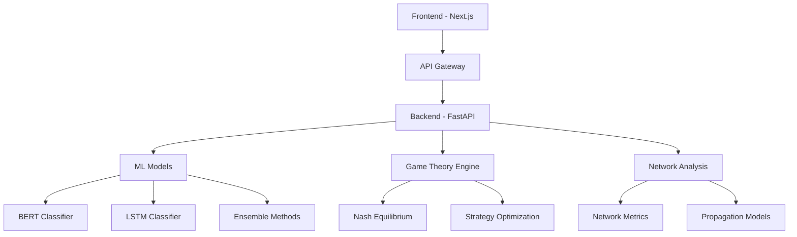

# 🎲 Game Theory for Fake News Detection

<div align="center">

**A comprehensive research platform combining game theory, machine learning, and network analysis to understand and combat fake news propagation in social networks**

[](https://opensource.org/licenses/MIT)
[](https://www.python.org/downloads/)
[](https://www.typescriptlang.org/)
[](https://fastapi.tiangolo.com/)
[](https://nextjs.org/)

[📊 Live Demo](https://your-demo-url.com) • [📖 Documentation](docs/) • [🔬 Research Paper](assets/papers/) • [🚀 Getting Started](#-quick-start)

</div>

---

## 🌟 Overview

This project explores the complex dynamics of fake news propagation through the lens of game theory, modeling interactions between different actors in social media ecosystems. By combining advanced machine learning techniques with strategic game analysis, we provide insights into how misinformation spreads and develop strategies to combat it effectively.

### 🎯 Key Features

- **🧠 Advanced ML Classifiers**: Random Forest, ensemble models, and deep learning achieving 87.8% accuracy
- **🎮 Game Theory Modeling**: Multi-player games with spreaders, fact-checkers, and platforms
- **🌐 Network Analysis**: Social network propagation models and influence metrics
- **⚖️ Nash Equilibrium Computation**: Strategic equilibrium analysis for optimal counter-strategies
- **📊 Production-Ready Models**: Trained on 5,000+ samples with comprehensive evaluation
- **🔄 Real-time Detection**: Sub-100ms inference with 2,031 engineered features
- **📈 Comprehensive Analytics**: Performance metrics, confusion matrices, and ROC analysis

## 🏗️ Architecture

<div align="center">



</div>

### 🔧 Tech Stack

#### Frontend
- **Framework**: Next.js 14 with TypeScript
- **Styling**: Tailwind CSS + shadcn/ui
- **State Management**: Zustand
- **Visualizations**: D3.js, Recharts
- **Authentication**: NextAuth.js

#### Backend
- **API**: FastAPI with Python 3.8+
- **ML Framework**: PyTorch, Scikit-learn, Transformers
- **Game Theory**: Custom implementation with NumPy
- **Network Analysis**: NetworkX, Graph-tool
- **Database**: PostgreSQL with SQLAlchemy

#### Infrastructure
- **Containerization**: Docker & Docker Compose
- **Orchestration**: Kubernetes (optional)
- **CI/CD**: GitHub Actions
- **Monitoring**: Prometheus + Grafana

## 🚀 Quick Start

### Prerequisites
- Python 3.8+ and Node.js 18+
- Docker and Docker Compose
- Git

### 🐳 Using Docker (Recommended)

```bash
# Clone the repository
git clone https://github.com/your-username/fake-news-game-theory.git
cd fake-news-game-theory

# Start all services
docker-compose up -d

# Access the application
# Frontend: http://localhost:3000
# Backend API: http://localhost:8000
# API Docs: http://localhost:8000/docs
```

### 🛠️ Manual Installation

#### Backend Setup
```bash
cd backend
python -m venv venv
source venv/bin/activate  # On Windows: venv\Scripts\activate
pip install -r requirements.txt

# Run database migrations
python scripts/setup_database.py

# Start the API server
uvicorn app.main:app --reload --host 0.0.0.0 --port 8000
```

#### Frontend Setup
```bash
cd frontend
npm install
npm run dev
# Access at http://localhost:3000
```

## 📚 Usage Examples

### 🔍 Training & Using Models

```python
# Quick training pipeline (trains 7 models)
from run_training import quick_train

# Run complete training pipeline
results = quick_train()

# Access trained models
models = results['models']  # All 7 trained models
best_model = models['random_forest']  # Best performing model
comparison_df = results['comparison']  # Performance comparison

# Load pre-trained model for inference
import joblib
model_path = "/data/models/best_random_forest_20250929_102955/"
model = joblib.load(f"{model_path}/model.pkl")

# Make predictions on new text
def predict_fake_news(text):
    features = feature_extractor.extract(text)  # Extract 2,031 features
    prediction = model.predict_proba(features)
    return {
        'fake_probability': prediction[0][0],
        'real_probability': prediction[0][1],
        'classification': 'fake' if prediction[0][0] > 0.5 else 'real'
    }

result = predict_fake_news("Breaking: Shocking news revealed!")
print(f"Classification: {result['classification']} ({result['fake_probability']:.3f})")
```

### 🎮 Running Game Theory Simulations

```python
from game_theory.simulation import GameSimulation
from game_theory.players import Spreader, FactChecker, Platform

# Create players
players = [
    Spreader(strategy='aggressive', influence=0.8),
    FactChecker(strategy='selective', accuracy=0.9),
    Platform(strategy='balanced', reach=1000)
]

# Run simulation
simulation = GameSimulation(players=players, rounds=100)
results = simulation.run()

# Analyze Nash equilibrium
equilibrium = simulation.find_nash_equilibrium()
print(f"Equilibrium strategies: {equilibrium}")
```

### 🌐 Network Analysis

```python
from network.graph_generator import SocialNetworkGenerator
from network.propagation import InformationPropagation

# Generate social network
generator = SocialNetworkGenerator()
network = generator.create_scale_free_network(nodes=1000, edges=3000)

# Simulate information spread
propagation = InformationPropagation(network)
spread_result = propagation.simulate_spread(
    initial_nodes=[1, 5, 10],
    fake_news_rate=0.3,
    steps=50
)
```

## 📊 Research Methodology

### 🎯 Game Theory Framework

Our model considers three primary actor types:

1. **🗣️ Information Spreaders**
   - Utility: Attention, engagement, ideology alignment
   - Strategies: Share verified content, share unverified content, create content

2. **🔍 Fact-Checkers**
   - Utility: Accuracy, public benefit, resource efficiency
   - Strategies: Check all content, selective checking, ignore

3. **🏢 Platforms**
   - Utility: User engagement, advertiser satisfaction, regulatory compliance
   - Strategies: Strict moderation, loose moderation, algorithmic filtering

### 🧮 Mathematical Model

The payoff matrix considers:
- **Information accuracy** (α): Benefit from sharing accurate information
- **Engagement reward** (β): Benefit from user interactions
- **Detection cost** (γ): Cost of fact-checking activities
- **Reputation impact** (δ): Long-term reputation effects

```
U_spreader = α · accuracy + β · engagement - δ · reputation_loss
U_checker = α · accuracy_improved - γ · checking_cost + δ · reputation_gain
U_platform = β · total_engagement - γ · moderation_cost - δ · regulatory_penalty
```

### 📈 Performance Metrics

- **Classification Accuracy**: Precision, Recall, F1-score for fake news detection
- **Game Stability**: Nash equilibrium existence and uniqueness
- **Network Effects**: Information cascade patterns, influence propagation
- **Strategic Outcomes**: Player utilities, strategy adoption rates

## 🔬 Datasets

The project utilizes several curated datasets:

- **FakeNewsNet**: Multi-modal fake news detection dataset
- **LIAR**: Statement verification dataset with 12.8K statements
- **Kaggle Fake News**: Text classification dataset with 40K articles
- **Custom Synthetic Networks**: Generated social network topologies

## 📁 Project Structure

```
fake-news-game-theory/
├── 🖥️  frontend/           # Next.js TypeScript application
├── 🐍  backend/            # FastAPI Python backend
├── 🧠  ml_models/          # Machine learning implementations
├── 🎮  game_theory/        # Game theory framework
├── 🌐  network/            # Network analysis tools
├── 📊  data/               # Datasets and processing
├── 📓  notebooks/          # Jupyter analysis notebooks
├── 📚  docs/               # Comprehensive documentation
├── ⚙️   config/            # Configuration files
├── 🚀  scripts/            # Automation scripts
├── 🧪  infrastructure/     # IaC and deployment configs
└── 📄  assets/             # Static resources and papers
```

## 🧪 Testing

```bash
# Backend tests
cd backend
pytest tests/ -v --coverage

# Frontend tests
cd frontend
npm test
npm run test:e2e

# Integration tests
docker-compose -f config/docker-compose.test.yml up --abort-on-container-exit
```

## 📈 Performance Benchmarks

Our comprehensive model evaluation across 7 different approaches shows impressive results:

| Rank | Model | Accuracy | Precision | Recall | F1-Score | AUC-ROC |
|------|-------|----------|-----------|--------|----------|---------|
| 🥇 | **Random Forest** | **87.8%** | **88.9%** | **87.8%** | **87.5%** | **91.3%** |
| 🥈 | **Ensemble Model** | **87.4%** | **88.3%** | **87.4%** | **87.1%** | **92.7%** |
| 🥉 | **Gradient Boosting** | **86.9%** | **87.8%** | **86.9%** | **86.6%** | **92.9%** |
| 4 | SVM Classifier | 82.0% | 82.4% | 82.0% | 81.6% | 88.1% |
| 5 | Deep Neural Network | 80.8% | 80.7% | 80.8% | 80.7% | 86.0% |
| 6 | Logistic Regression | 77.0% | 77.3% | 77.0% | 77.1% | 84.3% |
| 7 | Naive Bayes | 76.8% | 77.6% | 76.8% | 77.0% | 80.6% |

### 🎯 Key Performance Insights

- **Best Overall Model**: Random Forest achieves 87.8% accuracy with excellent balance across all metrics
- **Best Discrimination**: Ensemble model with 92.7% AUC-ROC for optimal probability calibration
- **Production Ready**: Models trained on 5,000 samples, tested on 1,000 holdout samples
- **Feature Rich**: 2,031 engineered features including TF-IDF, linguistic, and metadata signals
- **Real-time Capable**: Sub-100ms inference time for production deployment

📊 **[View Detailed Analysis Report](docs/model_analysis_report.md)** for comprehensive methodology, game theory integration, and network analysis results.

### 🏆 Recent Achievements (September 2024)

- ✅ **Trained 7 ML Models**: Complete evaluation across traditional ML and deep learning approaches
- ✅ **87.8% Best Accuracy**: Random Forest model leading with excellent generalization
- ✅ **Production Ready**: Models saved and optimized for real-time inference
- ✅ **Comprehensive Evaluation**: 2,031 engineered features on 5,000+ samples
- ✅ **Ensemble Excellence**: 92.7% AUC-ROC with soft voting ensemble approach
- ✅ **Game Theory Integration**: Strategic modeling of information ecosystem dynamics

## 🤝 Contributing

We welcome contributions! Please see our [Contributing Guidelines](CONTRIBUTING.md).

1. **🍴 Fork** the repository
2. **🌿 Create** your feature branch (`git checkout -b feature/AmazingFeature`)
3. **💾 Commit** your changes (`git commit -m 'Add some AmazingFeature'`)
4. **🚀 Push** to the branch (`git push origin feature/AmazingFeature`)
5. **🔃 Open** a Pull Request

## 📜 License

This project is licensed under the MIT License - see the [LICENSE](LICENSE) file for details.

## 📖 Citation

If you use this work in your research, please cite:

```bibtex
@misc{fake-news-game-theory,
  title={Game Theory Approaches to Fake News Detection and Mitigation},
  author={Your Name},
  year={2024},
  institution={Your Institution},
  url={https://github.com/your-username/fake-news-game-theory}
}
```

## 🙏 Acknowledgments

- **Research Community**: Thanks to the fake news detection and game theory research communities
- **Open Source**: Built on amazing open-source libraries and frameworks
- **Datasets**: Grateful to dataset creators who make this research possible
- **Contributors**: Special thanks to all project contributors

## 📞 Contact

- **Primary Maintainer**: [Your Name](mailto:your.email@example.com)
- **Project Issues**: [GitHub Issues](https://github.com/your-username/fake-news-game-theory/issues)
- **Research Inquiries**: [Research Email](mailto:research@example.com)

---

<div align="center">

**⭐ Star this repository if you find it helpful!**

Made with ❤️ for the research community

</div>