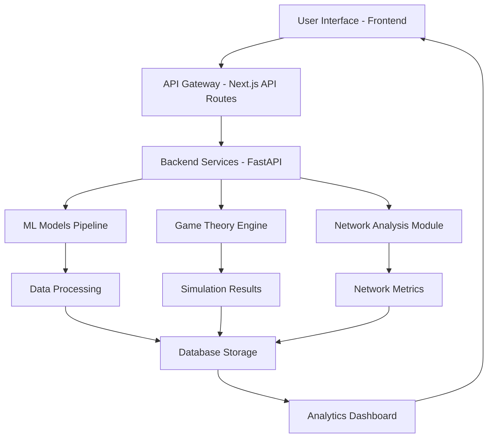
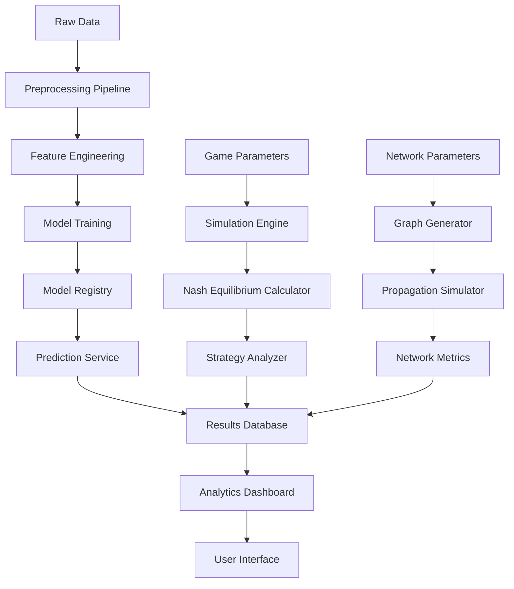

# 🔄 Project Workflow & File Architecture

## 📋 Overview
This document provides a comprehensive workflow of the fake-news-game-theory project, detailing how each component interacts and the purpose of every file in the system.

---

## 🏗️ System Architecture Flow



---

## 🚀 Complete Workflow Process

### 1. **Data Ingestion & Processing** 📊
```
Raw Data → Preprocessing → Feature Extraction → Model Training → Deployment
```

### 2. **Game Theory Simulation** 🎮
```
Player Definition → Strategy Selection → Payoff Calculation → Nash Equilibrium → Results Analysis
```

### 3. **Network Analysis** 🌐
```
Network Generation → Propagation Modeling → Influence Metrics → Visualization → Insights
```

---

## 📁 Detailed File Structure & Workflow

## **Frontend Architecture** (`/frontend/`)

### 🖥️ **User Interface Layer**

#### **`/src/app/` - Next.js App Router**
```
┌─ layout.tsx ──────────────────────────────────┐
│ • Root application layout                     │
│ • Global providers (Theme, Auth, Store)       │
│ • Navigation structure                        │
│ • Meta tags and SEO configuration            │
└───────────────────────────────────────────────┘
        ↓
┌─ page.tsx ────────────────────────────────────┐
│ • Landing page component                      │
│ • Hero section with project overview          │
│ • Quick access to main features               │
│ • Integration with dashboard components       │
└───────────────────────────────────────────────┘
```

#### **`/src/app/(dashboard)/` - Protected Routes**

**Analytics Module** (`/analytics/`)
```
📄 page.tsx
├─ Renders analytics dashboard
├─ Integrates MetricsCard components
├─ Displays model performance charts
├─ Connects to analytics API endpoints
└─ Real-time data updates via WebSocket

📄 loading.tsx
├─ Skeleton loading components
├─ Maintains UI consistency
└─ Enhances user experience
```

**Classifier Module** (`/classifier/`)
```
📄 page.tsx
├─ ML model interface
├─ Text input for fake news detection
├─ Model selection dropdown
├─ Results visualization
└─ Performance metrics display

📄 error.tsx
├─ Error boundary for classifier
├─ Graceful error handling
├─ Retry mechanisms
└─ User-friendly error messages
```

**Simulation Module** (`/simulation/`)
```
📄 page.tsx
├─ Game theory simulation interface
├─ Player configuration forms
├─ Strategy selection interface
├─ Real-time simulation progress
└─ Results visualization

📂 components/
├─ NetworkGraph.tsx ─────── Interactive network visualization
├─ GameParameters.tsx ────── Simulation parameter controls
└─ PayoffMatrix.tsx ──────── Payoff matrix display/editing
```

**Equilibrium Module** (`/equilibrium/`)
```
📄 page.tsx
├─ Nash equilibrium analysis
├─ Strategy comparison tools
├─ Equilibrium visualization
└─ Stability analysis results

📂 components/
├─ NashEquilibrium.tsx ──── Equilibrium calculation display
└─ StrategyComparison.tsx ── Strategy analysis charts
```

### 🔌 **API Integration Layer**

#### **`/src/app/api/` - Backend Communication**

**Classifier API** (`/api/classifier/`)
```
📄 predict/route.ts
├─ POST: Send text for classification
├─ Integrates with backend ML models
├─ Returns prediction confidence scores
├─ Handles batch processing
└─ Error handling and validation

📄 train/route.ts
├─ POST: Trigger model training
├─ File upload handling
├─ Training progress tracking
├─ Model versioning
└─ Training metrics collection

📄 metrics/route.ts
├─ GET: Retrieve model performance
├─ Historical metrics tracking
├─ Comparison between models
└─ Performance visualization data
```

**Simulation API** (`/api/simulation/`)
```
📄 run/route.ts
├─ POST: Execute game theory simulation
├─ Parameter validation
├─ Asynchronous simulation execution
├─ Progress tracking via WebSocket
└─ Results storage and retrieval

📄 parameters/route.ts
├─ GET/POST: Manage simulation parameters
├─ Default parameter sets
├─ Custom parameter validation
└─ Parameter history tracking

📄 results/route.ts
├─ GET: Retrieve simulation results
├─ Result filtering and pagination
├─ Export functionality
└─ Comparative analysis data
```

### 🧩 **Component Architecture**

#### **`/src/components/ui/` - Base Components**
```
📄 button.tsx ────────── Reusable button with variants
📄 card.tsx ──────────── Container component for content
📄 input.tsx ─────────── Form input with validation
📄 table.tsx ─────────── Data table with sorting/filtering
📄 dialog.tsx ────────── Modal dialogs and popups
📄 toast.tsx ─────────── Notification system
📄 progress.tsx ───────── Progress bars and indicators
```

#### **`/src/components/charts/` - Visualization**
```
📄 LineChart.tsx ─────── Time series data visualization
📄 BarChart.tsx ──────── Categorical data comparison
📄 ScatterPlot.tsx ───── Correlation analysis plots
📄 Heatmap.tsx ───────── Matrix data visualization
📄 NetworkVisualization.tsx ── Social network graphs
📄 PayoffHeatmap.tsx ──── Game theory payoff matrices
📄 PropagationChart.tsx ── Information spread animation
```

#### **`/src/components/forms/` - Data Input**
```
📄 DataUploadForm.tsx ──── File upload with validation
📄 SimulationConfigForm.tsx ── Game parameters input
📄 ClassifierConfigForm.tsx ── ML model configuration
📄 GameParametersForm.tsx ── Player strategy settings
```

### 🧠 **State Management** (`/src/store/`)
```
📄 simulationStore.ts
├─ Simulation state management
├─ Player configurations
├─ Results caching
└─ Progress tracking

📄 classifierStore.ts
├─ ML model states
├─ Training progress
├─ Performance metrics
└─ Model comparison data

📄 gameStore.ts
├─ Game theory calculations
├─ Equilibrium results
├─ Strategy analysis
└─ Historical data

📄 dataStore.ts
├─ Dataset management
├─ Upload progress
├─ Data preprocessing states
└─ Export functionality
```

### 🔧 **Utilities & Configuration**

#### **`/src/lib/` - Core Utilities**
```
📄 gameTheory.ts
├─ Nash equilibrium calculations
├─ Payoff matrix operations
├─ Strategy optimization algorithms
└─ Game stability analysis

📄 networkAnalysis.ts
├─ Graph theory algorithms
├─ Centrality measures
├─ Propagation models
└─ Network metrics calculation

📄 dataProcessing.ts
├─ Text preprocessing utilities
├─ Feature extraction functions
├─ Data validation schemas
└─ Export/import helpers
```

#### **`/src/hooks/` - Custom React Hooks**
```
📄 useSimulation.ts
├─ Simulation lifecycle management
├─ Real-time updates via WebSocket
├─ Progress tracking
└─ Error handling

📄 useClassifier.ts
├─ ML model interactions
├─ Prediction requests
├─ Training management
└─ Performance monitoring

📄 useWebSocket.ts
├─ Real-time communication
├─ Connection management
├─ Message handling
└─ Reconnection logic
```

---

## **Backend Architecture** (`/backend/`)

### 🐍 **API Layer** (`/app/api/v1/`)

#### **Core API Endpoints**
```
📄 classifier.py
├─ POST /predict ────────── Text classification endpoint
├─ POST /train ─────────── Model training initiation
├─ GET /models ─────────── Available models listing
├─ GET /metrics ────────── Performance metrics retrieval
├─ PUT /models/{id} ────── Model configuration updates
└─ DELETE /models/{id} ──── Model deletion

📄 simulation.py
├─ POST /run ───────────── Execute game simulation
├─ GET /results/{id} ───── Simulation results retrieval
├─ POST /parameters ────── Parameter configuration
├─ GET /equilibrium ────── Nash equilibrium calculation
├─ GET /strategies ─────── Available strategies listing
└─ POST /analyze ───────── Strategy analysis

📄 data.py
├─ POST /upload ────────── Dataset upload handling
├─ GET /datasets ───────── Dataset listing and metadata
├─ POST /preprocess ────── Data preprocessing pipeline
├─ GET /export/{format} ── Results export functionality
└─ DELETE /datasets/{id} ── Dataset deletion
```

### 🧠 **Machine Learning Pipeline** (`/ml_models/`)

#### **Classifier Architecture**
```
📄 base_classifier.py
├─ Abstract base class for all classifiers
├─ Common interface methods (train, predict, evaluate)
├─ Model serialization/deserialization
└─ Performance metrics calculation

📄 bert_classifier.py
├─ BERT-based transformer model
├─ Text tokenization and encoding
├─ Fine-tuning on fake news datasets
├─ Attention visualization
└─ Model interpretability features

📄 lstm_classifier.py
├─ LSTM neural network implementation
├─ Sequential text processing
├─ Bidirectional LSTM architecture
├─ Dropout and regularization
└─ Sequence-to-sequence modeling

📄 ensemble.py
├─ Ensemble method combining multiple models
├─ Voting and stacking strategies
├─ Model weight optimization
├─ Cross-validation integration
└─ Performance boosting techniques
```

#### **Data Processing Pipeline**
```
📄 text_processing.py
├─ Text cleaning and normalization
├─ Stop word removal
├─ Stemming and lemmatization
├─ N-gram feature extraction
└─ TF-IDF vectorization

📄 feature_extraction.py
├─ Linguistic feature engineering
├─ Sentiment analysis features
├─ Readability metrics
├─ Named entity recognition
└─ Semantic embeddings

📄 data_augmentation.py
├─ Text augmentation techniques
├─ Synthetic data generation
├─ Class imbalance handling
├─ Cross-lingual data augmentation
└─ Noise injection methods
```

### 🎮 **Game Theory Engine** (`/game_theory/`)

#### **Core Game Components**
```
📄 players.py
├─ Player class definitions
│  ├─ Spreader: Information dissemination agents
│  ├─ FactChecker: Verification agents
│  └─ Platform: Content moderation agents
├─ Player attribute management
├─ Strategy implementation interfaces
└─ Utility function definitions

📄 strategies.py
├─ Strategy pattern implementation
├─ Pure and mixed strategy support
├─ Adaptive strategy mechanisms
├─ Learning algorithms integration
└─ Strategy performance tracking

📄 payoffs.py
├─ Payoff matrix calculations
├─ Utility function implementations
├─ Cost-benefit analysis
├─ Risk assessment models
└─ Dynamic payoff adjustments

📄 equilibrium.py
├─ Nash equilibrium computation algorithms
├─ Multiple equilibria handling
├─ Stability analysis
├─ Convergence verification
└─ Equilibrium selection criteria

📄 simulation.py
├─ Multi-agent simulation engine
├─ Iterative game execution
├─ Strategy evolution tracking
├─ Population dynamics modeling
└─ Statistical analysis of outcomes
```

### 🌐 **Network Analysis Module** (`/network/`)

#### **Network Operations**
```
📄 graph_generator.py
├─ Social network topology generation
├─ Scale-free network creation
├─ Small-world network modeling
├─ Random graph generation
└─ Real network data import

📄 propagation.py
├─ Information diffusion models
├─ Epidemic-style spreading
├─ Threshold-based propagation
├─ Influence maximization
└─ Cascade effect simulation

📄 metrics.py
├─ Centrality measures (betweenness, closeness, eigenvector)
├─ Clustering coefficient calculation
├─ Path length analysis
├─ Network density computation
└─ Community detection algorithms

📄 visualization.py
├─ Network layout algorithms
├─ Interactive graph rendering
├─ Propagation animation
├─ Influence heatmaps
└─ Export functionality for visualizations
```

### 🔧 **Service Layer** (`/app/services/`)

#### **Business Logic Services**
```
📄 classifier_service.py
├─ ML model lifecycle management
├─ Training pipeline orchestration
├─ Model evaluation and comparison
├─ Prediction request handling
└─ Performance monitoring

📄 simulation_service.py
├─ Game simulation orchestration
├─ Parameter validation and preprocessing
├─ Multi-threaded simulation execution
├─ Result aggregation and analysis
└─ Real-time progress updates

📄 equilibrium_service.py
├─ Nash equilibrium calculation service
├─ Strategy analysis algorithms
├─ Stability assessment methods
├─ Comparative equilibrium analysis
└─ Visualization data preparation

📄 network_service.py
├─ Network analysis coordination
├─ Graph generation and manipulation
├─ Propagation simulation management
├─ Metrics calculation pipeline
└─ Visualization data preparation
```

---

## 🔄 **Complete Workflow Execution**

### **1. Data Input & Processing Workflow**
```
User Upload → Validation → Preprocessing → Feature Extraction → Model Ready
     ↓              ↓            ↓              ↓              ↓
Frontend Form → API Route → Service Layer → ML Pipeline → Database Storage
```

### **2. Classification Workflow**
```
Text Input → Tokenization → Model Inference → Post-processing → Results Display
     ↓           ↓              ↓               ↓              ↓
Frontend → Backend API → ML Model → Confidence Score → UI Update
```

### **3. Game Simulation Workflow**
```
Parameter Setup → Player Creation → Strategy Assignment → Simulation Run → Analysis
       ↓               ↓               ↓                ↓           ↓
Configuration → Player Objects → Strategy Objects → Game Engine → Results Store
       ↓               ↓               ↓                ↓           ↓
Frontend Form → Service Layer → Game Theory Module → Simulation → Database
```

### **4. Network Analysis Workflow**
```
Network Generation → Propagation Setup → Simulation → Metrics → Visualization
        ↓                  ↓              ↓         ↓         ↓
Graph Generator → Propagation Model → Network Engine → Analytics → Frontend Display
```

---

## 🔗 **Inter-Component Communication**

### **Frontend ↔ Backend**
- **REST API**: Standard CRUD operations
- **WebSocket**: Real-time updates during simulations
- **Server-Sent Events**: Progress notifications

### **Backend Internal**
- **Service Layer**: Business logic coordination
- **Database ORM**: Data persistence and retrieval
- **Message Queue**: Asynchronous task processing

### **ML Pipeline Integration**
- **Model Registry**: Centralized model management
- **Feature Store**: Reusable feature engineering
- **Experiment Tracking**: Model version control

---

## 📊 **Data Flow Architecture**



---

## 🧪 **Testing & Quality Assurance**

### **Testing Hierarchy**
```
Unit Tests → Integration Tests → End-to-End Tests → Performance Tests
     ↓              ↓                ↓                    ↓
Component Level → Service Level → Full Workflow → Load Testing
```

### **Quality Gates**
- **Code Coverage**: Minimum 80% for all modules
- **Performance**: API response time < 200ms
- **Accuracy**: ML model accuracy > 90%
- **Stability**: Game equilibrium convergence

---

## 🚀 **Deployment Pipeline**

```
Development → Testing → Staging → Production
     ↓          ↓         ↓         ↓
Local Dev → CI/CD → Docker → Kubernetes
     ↓          ↓         ↓         ↓
Git Push → Tests Run → Build Image → Deploy
```

This workflow ensures seamless integration between all components while maintaining high performance, scalability, and reliability across the entire fake news detection and game theory analysis platform.


📂 fake-news-game-theory/
┣ 📂 frontend/                          # Next.js TypeScript Frontend
┃ ┣ 📂 public/
┃ ┃ ┣ 📂 icons/
┃ ┃ ┃ ┣ favicon.ico
┃ ┃ ┃ ┣ logo.svg
┃ ┃ ┃ ┗ manifest.json
┃ ┃ ┣ 📂 images/
┃ ┃ ┃ ┣ hero-bg.webp
┃ ┃ ┃ ┣ network-visualization.png
┃ ┃ ┃ ┗ game-theory-diagram.svg
┃ ┃ ┗ robots.txt
┃ ┃
┃ ┣ 📂 src/
┃ ┃ ┣ 📂 app/                          # App Router (Next.js 13+)
┃ ┃ ┃ ┣ 📂 (dashboard)/               # Route Groups
┃ ┃ ┃ ┃ ┣ 📂 analytics/
┃ ┃ ┃ ┃ ┃ ┣ page.tsx
┃ ┃ ┃ ┃ ┃ ┗ loading.tsx
┃ ┃ ┃ ┃ ┣ 📂 classifier/
┃ ┃ ┃ ┃ ┃ ┣ page.tsx
┃ ┃ ┃ ┃ ┃ ┣ loading.tsx
┃ ┃ ┃ ┃ ┃ ┗ error.tsx
┃ ┃ ┃ ┃ ┣ 📂 simulation/
┃ ┃ ┃ ┃ ┃ ┣ page.tsx
┃ ┃ ┃ ┃ ┃ ┣ loading.tsx
┃ ┃ ┃ ┃ ┃ ┗ components/
┃ ┃ ┃ ┃ ┃   ┣ NetworkGraph.tsx
┃ ┃ ┃ ┃ ┃   ┣ GameParameters.tsx
┃ ┃ ┃ ┃ ┃   ┗ PayoffMatrix.tsx
┃ ┃ ┃ ┃ ┣ 📂 equilibrium/
┃ ┃ ┃ ┃ ┃ ┣ page.tsx
┃ ┃ ┃ ┃ ┃ ┗ components/
┃ ┃ ┃ ┃ ┃   ┣ NashEquilibrium.tsx
┃ ┃ ┃ ┃ ┃   ┗ StrategyComparison.tsx
┃ ┃ ┃ ┃ ┗ layout.tsx                  # Dashboard layout
┃ ┃ ┃ ┃
┃ ┃ ┃ ┣ 📂 api/                       # API Routes
┃ ┃ ┃ ┃ ┣ 📂 classifier/
┃ ┃ ┃ ┃ ┃ ┣ predict/
┃ ┃ ┃ ┃ ┃ ┃ ┗ route.ts
┃ ┃ ┃ ┃ ┃ ┣ train/
┃ ┃ ┃ ┃ ┃ ┃ ┗ route.ts
┃ ┃ ┃ ┃ ┃ ┗ metrics/
┃ ┃ ┃ ┃ ┃   ┗ route.ts
┃ ┃ ┃ ┃ ┣ 📂 simulation/
┃ ┃ ┃ ┃ ┃ ┣ run/
┃ ┃ ┃ ┃ ┃ ┃ ┗ route.ts
┃ ┃ ┃ ┃ ┃ ┣ parameters/
┃ ┃ ┃ ┃ ┃ ┃ ┗ route.ts
┃ ┃ ┃ ┃ ┃ ┗ results/
┃ ┃ ┃ ┃ ┃   ┗ route.ts
┃ ┃ ┃ ┃ ┣ 📂 data/
┃ ┃ ┃ ┃ ┃ ┣ upload/
┃ ┃ ┃ ┃ ┃ ┃ ┗ route.ts
┃ ┃ ┃ ┃ ┃ ┣ datasets/
┃ ┃ ┃ ┃ ┃ ┃ ┗ route.ts
┃ ┃ ┃ ┃ ┃ ┗ export/
┃ ┃ ┃ ┃ ┃   ┗ route.ts
┃ ┃ ┃ ┃ ┗ 📂 auth/
┃ ┃ ┃ ┃   ┗ [...nextauth]/
┃ ┃ ┃ ┃     ┗ route.ts
┃ ┃ ┃ ┃
┃ ┃ ┃ ┣ 📂 about/
┃ ┃ ┃ ┃ ┗ page.tsx
┃ ┃ ┃ ┣ 📂 research/
┃ ┃ ┃ ┃ ┣ page.tsx
┃ ┃ ┃ ┃ ┗ methodology/
┃ ┃ ┃ ┃   ┗ page.tsx
┃ ┃ ┃ ┣ 📂 datasets/
┃ ┃ ┃ ┃ ┗ page.tsx
┃ ┃ ┃ ┣ globals.css
┃ ┃ ┃ ┣ layout.tsx                    # Root layout
┃ ┃ ┃ ┣ page.tsx                      # Home page
┃ ┃ ┃ ┣ loading.tsx
┃ ┃ ┃ ┣ error.tsx
┃ ┃ ┃ ┗ not-found.tsx
┃ ┃ ┃
┃ ┃ ┣ 📂 components/                  # Reusable UI Components
┃ ┃ ┃ ┣ 📂 ui/                       # Base UI Components (shadcn/ui style)
┃ ┃ ┃ ┃ ┣ button.tsx
┃ ┃ ┃ ┃ ┣ card.tsx
┃ ┃ ┃ ┃ ┣ input.tsx
┃ ┃ ┃ ┃ ┣ textarea.tsx
┃ ┃ ┃ ┃ ┣ select.tsx
┃ ┃ ┃ ┃ ┣ tabs.tsx
┃ ┃ ┃ ┃ ┣ badge.tsx
┃ ┃ ┃ ┃ ┣ progress.tsx
┃ ┃ ┃ ┃ ┣ table.tsx
┃ ┃ ┃ ┃ ┣ dialog.tsx
┃ ┃ ┃ ┃ ┣ toast.tsx
┃ ┃ ┃ ┃ ┣ alert.tsx
┃ ┃ ┃ ┃ ┣ skeleton.tsx
┃ ┃ ┃ ┃ ┗ spinner.tsx
┃ ┃ ┃ ┃
┃ ┃ ┃ ┣ 📂 layout/                   # Layout Components
┃ ┃ ┃ ┃ ┣ Header.tsx
┃ ┃ ┃ ┃ ┣ Footer.tsx
┃ ┃ ┃ ┃ ┣ Sidebar.tsx
┃ ┃ ┃ ┃ ┣ Navigation.tsx
┃ ┃ ┃ ┃ ┗ Breadcrumbs.tsx
┃ ┃ ┃ ┃
┃ ┃ ┃ ┣ 📂 charts/                   # Visualization Components
┃ ┃ ┃ ┃ ┣ LineChart.tsx
┃ ┃ ┃ ┃ ┣ BarChart.tsx
┃ ┃ ┃ ┃ ┣ ScatterPlot.tsx
┃ ┃ ┃ ┃ ┣ Heatmap.tsx
┃ ┃ ┃ ┃ ┣ NetworkVisualization.tsx
┃ ┃ ┃ ┃ ┣ PayoffHeatmap.tsx
┃ ┃ ┃ ┃ ┗ PropagationChart.tsx
┃ ┃ ┃ ┃
┃ ┃ ┃ ┣ 📂 forms/                    # Form Components
┃ ┃ ┃ ┃ ┣ DataUploadForm.tsx
┃ ┃ ┃ ┃ ┣ SimulationConfigForm.tsx
┃ ┃ ┃ ┃ ┣ ClassifierConfigForm.tsx
┃ ┃ ┃ ┃ ┗ GameParametersForm.tsx
┃ ┃ ┃ ┃
┃ ┃ ┃ ┣ 📂 data-display/             # Data Display Components
┃ ┃ ┃ ┃ ┣ DataTable.tsx
┃ ┃ ┃ ┃ ┣ MetricsCard.tsx
┃ ┃ ┃ ┃ ┣ StatisticsPanel.tsx
┃ ┃ ┃ ┃ ┣ ResultsViewer.tsx
┃ ┃ ┃ ┃ ┗ ModelPerformance.tsx
┃ ┃ ┃ ┃
┃ ┃ ┃ ┣ 📂 game-theory/              # Game Theory Specific Components
┃ ┃ ┃ ┃ ┣ PayoffMatrix.tsx
┃ ┃ ┃ ┃ ┣ StrategySelector.tsx
┃ ┃ ┃ ┃ ┣ EquilibriumVisualizer.tsx
┃ ┃ ┃ ┃ ┣ PlayerActions.tsx
┃ ┃ ┃ ┃ ┗ GameResults.tsx
┃ ┃ ┃ ┃
┃ ┃ ┃ ┗ 📂 common/                   # Common Components
┃ ┃ ┃   ┣ LoadingSpinner.tsx
┃ ┃ ┃   ┣ ErrorBoundary.tsx
┃ ┃ ┃   ┣ ThemeToggle.tsx
┃ ┃ ┃   ┣ SearchBar.tsx
┃ ┃ ┃   ┗ PageHeader.tsx
┃ ┃ ┃
┃ ┃ ┣ 📂 lib/                        # Utilities and Configuration
┃ ┃ ┃ ┣ utils.ts                     # General utilities
┃ ┃ ┃ ┣ auth.ts                      # Authentication config
┃ ┃ ┃ ┣ api.ts                       # API client configuration
┃ ┃ ┃ ┣ constants.ts                 # App constants
┃ ┃ ┃ ┣ validations.ts               # Form validation schemas
┃ ┃ ┃ ┣ gameTheory.ts                # Game theory calculations
┃ ┃ ┃ ┣ networkAnalysis.ts           # Network analysis utilities
┃ ┃ ┃ ┗ dataProcessing.ts            # Data processing utilities
┃ ┃ ┃
┃ ┃ ┣ 📂 hooks/                      # Custom React Hooks
┃ ┃ ┃ ┣ useApi.ts                    # API interaction hook
┃ ┃ ┃ ┣ useSimulation.ts             # Simulation management hook
┃ ┃ ┃ ┣ useWebSocket.ts              # Real-time updates hook
┃ ┃ ┃ ┣ useClassifier.ts             # ML classifier hook
┃ ┃ ┃ ┣ useGameState.ts              # Game state management hook
┃ ┃ ┃ ┣ useDataUpload.ts             # Data upload hook
┃ ┃ ┃ ┗ useLocalStorage.ts           # Local storage hook
┃ ┃ ┃
┃ ┃ ┣ 📂 store/                      # State Management (Zustand/Redux)
┃ ┃ ┃ ┣ index.ts                     # Store configuration
┃ ┃ ┃ ┣ simulationStore.ts           # Simulation state
┃ ┃ ┃ ┣ classifierStore.ts           # ML model state
┃ ┃ ┃ ┣ gameStore.ts                 # Game theory state
┃ ┃ ┃ ┣ dataStore.ts                 # Data management state
┃ ┃ ┃ ┗ uiStore.ts                   # UI state (theme, sidebar, etc.)
┃ ┃ ┃
┃ ┃ ┣ 📂 types/                      # TypeScript Type Definitions
┃ ┃ ┃ ┣ index.ts                     # Common types
┃ ┃ ┃ ┣ api.ts                       # API response/request types
┃ ┃ ┃ ┣ gameTheory.ts                # Game theory related types
┃ ┃ ┃ ┣ simulation.ts                # Simulation types
┃ ┃ ┃ ┣ classifier.ts                # ML classifier types
┃ ┃ ┃ ┣ network.ts                   # Network analysis types
┃ ┃ ┃ ┗ data.ts                      # Data structures types
┃ ┃ ┃
┃ ┃ ┣ 📂 styles/                     # Styling
┃ ┃ ┃ ┣ globals.css                  # Global styles
┃ ┃ ┃ ┣ components.css               # Component-specific styles
┃ ┃ ┃ ┗ charts.css                   # Chart styling
┃ ┃ ┃
┃ ┃ ┗ 📂 config/                     # Configuration Files
┃ ┃   ┣ database.ts                  # Database configuration
┃ ┃   ┣ api.ts                       # API configuration
┃ ┃   ┣ ml-models.ts                 # ML model configurations
┃ ┃   ┗ visualization.ts             # Chart/visualization configs
┃ ┃
┃ ┣ 📂 __tests__/                    # Testing
┃ ┃ ┣ 📂 components/
┃ ┃ ┃ ┣ Header.test.tsx
┃ ┃ ┃ ┣ NetworkVisualization.test.tsx
┃ ┃ ┃ ┗ PayoffMatrix.test.tsx
┃ ┃ ┣ 📂 pages/
┃ ┃ ┃ ┣ index.test.tsx
┃ ┃ ┃ ┗ simulation.test.tsx
┃ ┃ ┣ 📂 api/
┃ ┃ ┃ ┣ classifier.test.ts
┃ ┃ ┃ ┗ simulation.test.ts
┃ ┃ ┣ 📂 utils/
┃ ┃ ┃ ┣ gameTheory.test.ts
┃ ┃ ┃ ┗ networkAnalysis.test.ts
┃ ┃ ┗ setup.ts
┃ ┃
┃ ┣ 📂 docs/                         # Documentation
┃ ┃ ┣ API.md
┃ ┃ ┣ COMPONENTS.md
┃ ┃ ┣ DEPLOYMENT.md
┃ ┃ ┗ GAME_THEORY.md
┃ ┃
┃ ┣ .env.local                       # Environment variables (local)
┃ ┣ .env.example                     # Environment variables template
┃ ┣ .gitignore
┃ ┣ .eslintrc.json                   # ESLint configuration
┃ ┣ .prettierrc                      # Prettier configuration
┃ ┣ next.config.js                   # Next.js configuration
┃ ┣ tailwind.config.js               # Tailwind CSS configuration
┃ ┣ tsconfig.json                    # TypeScript configuration
┃ ┣ package.json                     # Dependencies and scripts
┃ ┣ package-lock.json
┃ ┗ README.md                        # Frontend documentation
┃
┣ 📂 backend/                        # Python Backend (ML/Game Theory)
┃ ┣ 📂 app/                          # FastAPI Application
┃ ┃ ┣ 📂 api/                        # API Endpoints
┃ ┃ ┃ ┣ 📂 v1/
┃ ┃ ┃ ┃ ┣ __init__.py
┃ ┃ ┃ ┃ ┣ classifier.py              # ML classifier endpoints
┃ ┃ ┃ ┃ ┣ simulation.py              # Game simulation endpoints
┃ ┃ ┃ ┃ ┣ data.py                    # Data management endpoints
┃ ┃ ┃ ┃ ┣ analysis.py                # Analysis endpoints
┃ ┃ ┃ ┃ ┗ equilibrium.py             # Nash equilibrium endpoints
┃ ┃ ┃ ┗ __init__.py
┃ ┃ ┃
┃ ┃ ┣ 📂 core/                       # Core Application Logic
┃ ┃ ┃ ┣ __init__.py
┃ ┃ ┃ ┣ config.py                    # Configuration settings
┃ ┃ ┃ ┣ security.py                  # Authentication/Security
┃ ┃ ┃ ┣ database.py                  # Database connection
┃ ┃ ┃ ┗ logging.py                   # Logging configuration
┃ ┃ ┃
┃ ┃ ┣ 📂 models/                     # Data Models (Pydantic)
┃ ┃ ┃ ┣ __init__.py
┃ ┃ ┃ ┣ classifier.py                # ML model schemas
┃ ┃ ┃ ┣ game_theory.py               # Game theory schemas
┃ ┃ ┃ ┣ simulation.py                # Simulation schemas
┃ ┃ ┃ ┗ common.py                    # Common schemas
┃ ┃ ┃
┃ ┃ ┣ 📂 services/                   # Business Logic
┃ ┃ ┃ ┣ __init__.py
┃ ┃ ┃ ┣ classifier_service.py        # ML classification logic
┃ ┃ ┃ ┣ simulation_service.py        # Game simulation logic
┃ ┃ ┃ ┣ network_service.py           # Network analysis logic
┃ ┃ ┃ ┣ equilibrium_service.py       # Nash equilibrium calculations
┃ ┃ ┃ ┗ data_service.py              # Data processing logic
┃ ┃ ┃
┃ ┃ ┣ 📂 utils/                      # Utilities
┃ ┃ ┃ ┣ __init__.py
┃ ┃ ┃ ┣ data_preprocessing.py        # Data cleaning utilities
┃ ┃ ┃ ┣ visualization.py             # Plot generation utilities
┃ ┃ ┃ ┣ file_handlers.py             # File I/O utilities
┃ ┃ ┃ ┗ validators.py                # Input validation utilities
┃ ┃ ┃
┃ ┃ ┗ main.py                        # FastAPI application entry point
┃ ┃
┃ ┣ 📂 ml_models/                    # Machine Learning Models
┃ ┃ ┣ 📂 classifiers/                # Fake news classifiers
┃ ┃ ┃ ┣ __init__.py
┃ ┃ ┃ ┣ base_classifier.py           # Base classifier class
┃ ┃ ┃ ┣ logistic_regression.py       # Logistic regression classifier
┃ ┃ ┃ ┣ bert_classifier.py           # BERT-based classifier
┃ ┃ ┃ ┣ lstm_classifier.py           # LSTM classifier
┃ ┃ ┃ ┗ ensemble.py                  # Ensemble methods
┃ ┃ ┃
┃ ┃ ┣ 📂 preprocessing/              # Data preprocessing
┃ ┃ ┃ ┣ __init__.py
┃ ┃ ┃ ┣ text_processing.py           # Text preprocessing
┃ ┃ ┃ ┣ feature_extraction.py        # Feature engineering
┃ ┃ ┃ ┗ data_augmentation.py         # Data augmentation
┃ ┃ ┃
┃ ┃ ┗ 📂 evaluation/                 # Model evaluation
┃ ┃   ┣ __init__.py
┃ ┃   ┣ metrics.py                   # Evaluation metrics
┃ ┃   ┣ cross_validation.py          # Cross-validation
┃ ┃   ┗ visualization.py             # Results visualization
┃ ┃
┃ ┣ 📂 game_theory/                  # Game Theory Implementation
┃ ┃ ┣ __init__.py
┃ ┃ ┣ players.py                     # Player classes (Spreader, Fact-checker, Platform)
┃ ┃ ┣ strategies.py                  # Strategy implementations
┃ ┃ ┣ payoffs.py                     # Payoff calculation functions
┃ ┃ ┣ equilibrium.py                 # Nash equilibrium calculations
┃ ┃ ┣ simulation.py                  # Game simulation engine
┃ ┃ ┗ analysis.py                    # Game analysis utilities
┃ ┃
┃ ┣ 📂 network/                      # Network Analysis
┃ ┃ ┣ __init__.py
┃ ┃ ┣ graph_generator.py             # Social network generation
┃ ┃ ┣ propagation.py                 # Information propagation models
┃ ┃ ┣ metrics.py                     # Network metrics calculation
┃ ┃ ┗ visualization.py               # Network visualization
┃ ┃
┃ ┣ 📂 tests/                        # Backend Tests
┃ ┃ ┣ 📂 api/
┃ ┃ ┃ ┣ test_classifier.py
┃ ┃ ┃ ┣ test_simulation.py
┃ ┃ ┃ ┗ test_data.py
┃ ┃ ┣ 📂 services/
┃ ┃ ┃ ┣ test_classifier_service.py
┃ ┃ ┃ ┣ test_simulation_service.py
┃ ┃ ┃ ┗ test_equilibrium_service.py
┃ ┃ ┣ 📂 game_theory/
┃ ┃ ┃ ┣ test_players.py
┃ ┃ ┃ ┣ test_strategies.py
┃ ┃ ┃ ┗ test_equilibrium.py
┃ ┃ ┗ conftest.py
┃ ┃
┃ ┣ 📂 scripts/                      # Utility Scripts
┃ ┃ ┣ train_models.py                # Model training script
┃ ┃ ┣ data_pipeline.py               # Data processing pipeline
┃ ┃ ┣ run_simulation.py              # Simulation runner
┃ ┃ ┗ generate_results.py            # Results generation
┃ ┃
┃ ┣ requirements.txt                 # Python dependencies
┃ ┣ requirements-dev.txt             # Development dependencies
┃ ┣ Dockerfile                      # Docker configuration
┃ ┣ .env                           # Environment variables
┃ ┣ .env.example                   # Environment template
┃ ┣ .gitignore                     # Git ignore rules
┃ ┣ pytest.ini                     # Pytest configuration
┃ ┗ README.md                      # Backend documentation
┃
┣ 📂 data/                          # Datasets and Data Files
┃ ┣ 📂 raw/                         # Raw datasets
┃ ┃ ┣ fakenewsnet/
┃ ┃ ┣ liar_dataset/
┃ ┃ ┗ kaggle_fake_news/
┃ ┃
┃ ┣ 📂 processed/                   # Processed datasets
┃ ┃ ┣ train/
┃ ┃ ┣ test/
┃ ┃ ┣ validation/
┃ ┃ ┗ features/
┃ ┃
┃ ┣ 📂 networks/                   # Social network data
┃ ┃ ┣ synthetic_networks/
┃ ┃ ┗ real_networks/
┃ ┃
┃ ┗ 📂 results/                     # Analysis results
┃   ┣ models/
┃   ┣ simulations/
┃   ┣ visualizations/
┃   ┗ reports/
┃
┣ 📂 notebooks/                     # Jupyter Notebooks
┃ ┣ 01_data_exploration.ipynb       # Exploratory Data Analysis
┃ ┣ 02_feature_engineering.ipynb    # Feature engineering
┃ ┣ 03_model_training.ipynb         # Model training and evaluation
┃ ┣ 04_network_analysis.ipynb       # Network analysis
┃ ┣ 05_game_theory_analysis.ipynb   # Game theory modeling
┃ ┣ 06_simulation_experiments.ipynb # Simulation experiments
┃ ┗ 07_results_visualization.ipynb  # Results visualization
┃
┣ 📂 docs/                          # Project Documentation
┃ ┣ 📂 api/                         # API documentation
┃ ┃ ┣ endpoints.md
┃ ┃ ┗ examples.md
┃ ┃
┃ ┣ 📂 methodology/                 # Research methodology
┃ ┃ ┣ game_theory.md
┃ ┃ ┣ machine_learning.md
┃ ┃ ┗ network_analysis.md
┃ ┃
┃ ┣ 📂 tutorials/                   # How-to guides
┃ ┃ ┣ setup.md
┃ ┃ ┣ running_simulations.md
┃ ┃ ┗ model_training.md
┃ ┃
┃ ┣ architecture.md                 # System architecture
┃ ┣ deployment.md                   # Deployment guide
┃ ┗ contributing.md                 # Contribution guidelines
┃
┣ 📂 config/                        # Configuration Files
┃ ┣ docker-compose.yml              # Multi-container Docker setup
┃ ┣ docker-compose.dev.yml          # Development environment
┃ ┣ docker-compose.prod.yml         # Production environment
┃ ┣ nginx.conf                      # Nginx configuration
┃ ┣ .env.example                    # Environment variables template
┃ ┗ database/
┃   ┣ init.sql                      # Database initialization
┃   └── migrations/                 # Database migrations
┃
┣ 📂 scripts/                       # Project Scripts
┃ ┣ setup.sh                        # Project setup script
┃ ┣ install-dependencies.sh         # Dependencies installation
┃ ┣ run-dev.sh                      # Development server script
┃ ┣ run-prod.sh                     # Production deployment script
┃ ┣ backup-data.sh                  # Data backup script
┃ ┣ test-all.sh                     # Run all tests
┃ ┗ deploy.sh                       # Deployment script
┃
┣ 📂 .github/                       # GitHub Configuration
┃ ┣ 📂 workflows/                   # GitHub Actions
┃ ┃ ┣ ci.yml                        # Continuous Integration
┃ ┃ ┣ cd.yml                        # Continuous Deployment
┃ ┃ ┣ test.yml                      # Automated Testing
┃ ┃ ┗ security.yml                  # Security Scanning
┃ ┃
┃ ┣ 📂 ISSUE_TEMPLATE/              # Issue Templates
┃ ┃ ┣ bug_report.md
┃ ┃ ┣ feature_request.md
┃ ┃ ┗ research_question.md
┃ ┃
┃ ┣ 📂 PULL_REQUEST_TEMPLATE/       # PR Templates
┃ ┃ ┗ pull_request_template.md
┃ ┃
┃ ┗ FUNDING.yml                     # Funding information
┃
┣ 📂 infrastructure/                # Infrastructure as Code
┃ ┣ 📂 terraform/                   # Terraform configurations
┃ ┃ ┣ main.tf
┃ ┃ ┣ variables.tf
┃ ┃ ┣ outputs.tf
┃ ┃ ┗ modules/
┃ ┃   ┣ vpc/
┃ ┃   ┣ compute/
┃ ┃   ┗ database/
┃ ┃
┃ ┣ 📂 kubernetes/                  # Kubernetes manifests
┃ ┃ ┣ namespace.yaml
┃ ┃ ┣ deployment.yaml
┃ ┃ ┣ service.yaml
┃ ┃ ┣ ingress.yaml
┃ ┃ ┗ configmap.yaml
┃ ┃
┃ ┗ 📂 monitoring/                  # Monitoring setup
┃   ┣ prometheus.yml
┃   ┣ grafana/
┃   ┃ ┣ dashboards/
┃   ┃ ┗ datasources/
┃   ┗ alerts/
┃
┣ 📂 assets/                        # Static Assets
┃ ┣ 📂 images/                      # Project images
┃ ┃ ┣ architecture-diagram.png
┃ ┃ ┣ game-theory-flowchart.svg
┃ ┃ ┣ network-example.png
┃ ┃ ┗ results-preview/
┃ ┃
┃ ┣ 📂 papers/                      # Research papers and references
┃ ┃ ┣ literature-review/
┃ ┃ ┣ methodology/
┃ ┃ ┗ results/
┃ ┃
┃ ┗ 📂 presentations/               # Presentation materials
┃   ┣ project-overview.pptx
┃   ┣ methodology-presentation.pdf
┃   ┗ results-presentation.pptx
┃
┣ .gitignore                        # Git ignore rules
┣ .gitattributes                    # Git attributes
┣ .dockerignore                     # Docker ignore rules
┣ .editorconfig                     # Editor configuration
┣ LICENSE                           # Project license
┣ CHANGELOG.md                      # Change log
┣ CONTRIBUTING.md                   # Contribution guidelines
┣ CODE_OF_CONDUCT.md                # Code of conduct
┣ SECURITY.md                       # Security policy
┣ README.md                         # Main project documentation
┗ Makefile                          # Build automation


📋 Development Roadmap: Line-by-Line Implementation Guide
Phase 1: Project Foundation & Infrastructure Setup
1.1 Initial Repository Setup

Root Directory: Create .gitignore, .gitattributes, .dockerignore, .editorconfig
Root Directory: Create LICENSE (MIT), README.md, CHANGELOG.md
Root Directory: Create CONTRIBUTING.md, CODE_OF_CONDUCT.md, SECURITY.md
Root Directory: Create Makefile for build automation

1.2 Docker & Infrastructure Configuration

config/: Create docker-compose.yml (base configuration)
config/: Create docker-compose.dev.yml (development overrides)
config/: Create docker-compose.prod.yml (production overrides)
config/: Create nginx.conf (reverse proxy configuration)
config/: Create .env.example (environment template)
config/database/: Create init.sql (database schema initialization)

1.3 CI/CD Pipeline Setup

.github/workflows/: Create ci.yml (continuous integration workflow)
.github/workflows/: Create cd.yml (continuous deployment workflow)
.github/workflows/: Create test.yml (automated testing workflow)
.github/workflows/: Create security.yml (security scanning workflow)


Phase 2: Backend Foundation
2.1 Core Application Setup

backend/: Create requirements.txt (core dependencies)
backend/: Create requirements-dev.txt (development dependencies)
backend/: Create Dockerfile (containerization)
backend/: Create .env.example, pytest.ini
backend/app/: Create main.py (FastAPI application entry point)

2.2 Core Configuration

backend/app/core/: Create __init__.py
backend/app/core/: Create config.py (settings and configuration)
backend/app/core/: Create database.py (database connection management)
backend/app/core/: Create security.py (authentication, JWT, password hashing)
backend/app/core/: Create logging.py (logging configuration)

2.3 Database Models (Pydantic Schemas)

backend/app/models/: Create __init__.py
backend/app/models/: Create common.py (base models, shared schemas)
backend/app/models/: Create classifier.py (ML classifier request/response models)
backend/app/models/: Create game_theory.py (game theory schemas)
backend/app/models/: Create simulation.py (simulation parameters and results)

2.4 Utility Functions

backend/app/utils/: Create __init__.py
backend/app/utils/: Create data_preprocessing.py (text cleaning, normalization)
backend/app/utils/: Create validators.py (input validation functions)
backend/app/utils/: Create file_handlers.py (file upload/download utilities)
backend/app/utils/: Create visualization.py (backend plot generation)


Phase 3: Machine Learning Components
3.1 Base ML Infrastructure

backend/ml_models/classifiers/: Create __init__.py
backend/ml_models/classifiers/: Create base_classifier.py (abstract base class)
backend/ml_models/preprocessing/: Create __init__.py
backend/ml_models/preprocessing/: Create text_processing.py (tokenization, cleaning)
backend/ml_models/preprocessing/: Create feature_extraction.py (TF-IDF, embeddings)

3.2 Classification Models

backend/ml_models/classifiers/: Create logistic_regression.py (baseline classifier)
backend/ml_models/classifiers/: Create bert_classifier.py (BERT implementation)
backend/ml_models/classifiers/: Create lstm_classifier.py (LSTM with attention)
backend/ml_models/classifiers/: Create ensemble.py (ensemble voting/stacking)

3.3 Model Evaluation

backend/ml_models/evaluation/: Create __init__.py
backend/ml_models/evaluation/: Create metrics.py (accuracy, F1, AUC-ROC)
backend/ml_models/evaluation/: Create cross_validation.py (CV strategies)
backend/ml_models/evaluation/: Create visualization.py (confusion matrix, ROC curves)


Phase 4: Game Theory Engine
4.1 Core Game Theory Components

backend/game_theory/: Create __init__.py
backend/game_theory/: Create players.py (Spreader, Fact-checker, Platform classes)
backend/game_theory/: Create strategies.py (strategy space definitions)
backend/game_theory/: Create payoffs.py (utility function calculations)

4.2 Equilibrium Analysis

backend/game_theory/: Create equilibrium.py (Nash equilibrium solver)
backend/game_theory/: Create simulation.py (game simulation engine)
backend/game_theory/: Create analysis.py (stability analysis, ESS)


Phase 5: Network Analysis
5.1 Network Infrastructure

backend/network/: Create __init__.py
backend/network/: Create graph_generator.py (BA, WS, ER network generation)
backend/network/: Create propagation.py (IC, LT propagation models)
backend/network/: Create metrics.py (centrality, clustering, modularity)
backend/network/: Create visualization.py (network layout algorithms)


Phase 6: Business Logic Services
6.1 Core Services

backend/app/services/: Create __init__.py
backend/app/services/: Create classifier_service.py (ML classification orchestration)
backend/app/services/: Create simulation_service.py (game simulation management)
backend/app/services/: Create network_service.py (network analysis operations)
backend/app/services/: Create equilibrium_service.py (equilibrium calculations)
backend/app/services/: Create data_service.py (data processing pipeline)


Phase 7: API Endpoints
7.1 Classifier Endpoints

backend/app/api/v1/: Create __init__.py
backend/app/api/v1/: Create classifier.py (predict, train, metrics endpoints)

7.2 Simulation Endpoints

backend/app/api/v1/: Create simulation.py (run, status, results endpoints)

7.3 Analysis Endpoints

backend/app/api/v1/: Create equilibrium.py (Nash equilibrium calculation)
backend/app/api/v1/: Create analysis.py (network analysis endpoints)
backend/app/api/v1/: Create data.py (upload, export, dataset management)


Phase 8: Backend Testing
8.1 Test Configuration

backend/tests/: Create conftest.py (pytest fixtures)

8.2 Unit Tests

backend/tests/api/: Create test_classifier.py
backend/tests/api/: Create test_simulation.py
backend/tests/services/: Create test_classifier_service.py
backend/tests/game_theory/: Create test_equilibrium.py


Phase 9: Frontend Foundation
9.1 Next.js Configuration

frontend/: Create package.json (dependencies)
frontend/: Create next.config.js (Next.js configuration)
frontend/: Create tailwind.config.js (Tailwind CSS config)
frontend/: Create tsconfig.json (TypeScript configuration)
frontend/: Create .eslintrc.json, .prettierrc
frontend/: Create .env.example, .env.local

9.2 Type Definitions

frontend/src/types/: Create index.ts (common types)
frontend/src/types/: Create api.ts (API types)
frontend/src/types/: Create gameTheory.ts (game theory types)
frontend/src/types/: Create simulation.ts (simulation types)
frontend/src/types/: Create classifier.ts (ML types)
frontend/src/types/: Create network.ts (network types)

9.3 Utilities & Configuration

frontend/src/lib/: Create utils.ts (helper functions)
frontend/src/lib/: Create api.ts (API client configuration)
frontend/src/lib/: Create constants.ts (app constants)
frontend/src/lib/: Create validations.ts (Zod schemas)
frontend/src/lib/: Create gameTheory.ts (client-side game theory utils)


Phase 10: State Management
10.1 Zustand Stores

frontend/src/store/: Create index.ts (store configuration)
frontend/src/store/: Create simulationStore.ts (simulation state)
frontend/src/store/: Create classifierStore.ts (classifier state)
frontend/src/store/: Create gameStore.ts (game theory state)
frontend/src/store/: Create uiStore.ts (UI state - theme, sidebar)


Phase 11: Custom Hooks
11.1 API Hooks

frontend/src/hooks/: Create useApi.ts (generic API hook)
frontend/src/hooks/: Create useClassifier.ts (classification operations)
frontend/src/hooks/: Create useSimulation.ts (simulation management)
frontend/src/hooks/: Create useWebSocket.ts (real-time updates)
frontend/src/hooks/: Create useDataUpload.ts (file upload)


Phase 12: Base UI Components
12.1 Primitive UI Components

frontend/src/components/ui/: Create button.tsx (button component)
frontend/src/components/ui/: Create card.tsx (card container)
frontend/src/components/ui/: Create input.tsx, textarea.tsx
frontend/src/components/ui/: Create select.tsx, tabs.tsx
frontend/src/components/ui/: Create dialog.tsx, toast.tsx
frontend/src/components/ui/: Create progress.tsx, spinner.tsx
frontend/src/components/ui/: Create table.tsx, badge.tsx

12.2 Layout Components

frontend/src/components/layout/: Create Header.tsx
frontend/src/components/layout/: Create Sidebar.tsx
frontend/src/components/layout/: Create Footer.tsx
frontend/src/components/layout/: Create Navigation.tsx


Phase 13: Visualization Components
13.1 Chart Components

frontend/src/components/charts/: Create LineChart.tsx (Recharts)
frontend/src/components/charts/: Create BarChart.tsx
frontend/src/components/charts/: Create Heatmap.tsx
frontend/src/components/charts/: Create NetworkVisualization.tsx (D3.js)
frontend/src/components/charts/: Create PropagationChart.tsx

13.2 Game Theory Components

frontend/src/components/game-theory/: Create PayoffMatrix.tsx
frontend/src/components/game-theory/: Create EquilibriumVisualizer.tsx
frontend/src/components/game-theory/: Create StrategySelector.tsx


Phase 14: Form Components
14.1 Complex Forms

frontend/src/components/forms/: Create DataUploadForm.tsx (file upload)
frontend/src/components/forms/: Create SimulationConfigForm.tsx
frontend/src/components/forms/: Create ClassifierConfigForm.tsx
frontend/src/components/forms/: Create GameParametersForm.tsx


Phase 15: Page Routes
15.1 Root Layout & Pages

frontend/src/app/: Create layout.tsx (root layout)
frontend/src/app/: Create page.tsx (home page)
frontend/src/app/: Create globals.css (global styles)
frontend/src/app/: Create loading.tsx, error.tsx, not-found.tsx

15.2 Dashboard Routes

frontend/src/app/(dashboard)/: Create layout.tsx (dashboard layout)
frontend/src/app/(dashboard)/analytics/: Create page.tsx
frontend/src/app/(dashboard)/classifier/: Create page.tsx
frontend/src/app/(dashboard)/simulation/: Create page.tsx
frontend/src/app/(dashboard)/equilibrium/: Create page.tsx

15.3 Simulation Components

frontend/src/app/(dashboard)/simulation/components/: Create NetworkGraph.tsx
frontend/src/app/(dashboard)/simulation/components/: Create GameParameters.tsx
frontend/src/app/(dashboard)/simulation/components/: Create PayoffMatrix.tsx


Phase 16: API Routes (Next.js)
16.1 Classifier API Routes

frontend/src/app/api/classifier/predict/: Create route.ts
frontend/src/app/api/classifier/train/: Create route.ts
frontend/src/app/api/classifier/metrics/: Create route.ts

16.2 Simulation API Routes

frontend/src/app/api/simulation/run/: Create route.ts
frontend/src/app/api/simulation/parameters/: Create route.ts
frontend/src/app/api/simulation/results/: Create route.ts

16.3 Data API Routes

frontend/src/app/api/data/upload/: Create route.ts
frontend/src/app/api/data/datasets/: Create route.ts


Phase 17: Testing Infrastructure
17.1 Frontend Tests

frontend/tests/: Create setup.ts (test configuration)
frontend/tests/components/: Create PayoffMatrix.test.tsx
frontend/tests/components/: Create NetworkVisualization.test.tsx
frontend/tests/utils/: Create gameTheory.test.ts


Phase 18: Data Pipeline & Scripts
18.1 Backend Scripts

backend/scripts/: Create train_models.py (model training pipeline)
backend/scripts/: Create data_pipeline.py (ETL pipeline)
backend/scripts/: Create run_simulation.py (batch simulations)

18.2 Deployment Scripts

scripts/: Create setup.sh (project initialization)
scripts/: Create install-dependencies.sh
scripts/: Create run-dev.sh, run-prod.sh
scripts/: Create test-all.sh (run all tests)
scripts/: Create deploy.sh (deployment automation)


Phase 19: Documentation
19.1 API Documentation

docs/api/: Create endpoints.md (API reference)
docs/api/: Create examples.md (usage examples)

19.2 Methodology Documentation

docs/methodology/: Create game_theory.md
docs/methodology/: Create machine_learning.md
docs/methodology/: Create network_analysis.md

19.3 Tutorial Documentation

docs/tutorials/: Create setup.md (getting started)
docs/tutorials/: Create running_simulations.md
docs/tutorials/: Create model_training.md


Phase 20: Infrastructure as Code
20.1 Kubernetes Configuration

infrastructure/kubernetes/: Create namespace.yaml
infrastructure/kubernetes/: Create deployment.yaml
infrastructure/kubernetes/: Create service.yaml
infrastructure/kubernetes/: Create ingress.yaml

20.2 Terraform Configuration

infrastructure/terraform/: Create main.tf (main infrastructure)
infrastructure/terraform/: Create variables.tf, outputs.tf
infrastructure/terraform/modules/: Create VPC, compute, database modules

20.3 Monitoring Setup

infrastructure/monitoring/: Create prometheus.yml
infrastructure/monitoring/grafana/: Create dashboards and datasources


Phase 21: Jupyter Notebooks

notebooks/: Create 01_data_exploration.ipynb
notebooks/: Create 02_feature_engineering.ipynb
notebooks/: Create 03_model_training.ipynb
notebooks/: Create 04_network_analysis.ipynb
notebooks/: Create 05_game_theory_analysis.ipynb
notebooks/: Create 06_simulation_experiments.ipynb
notebooks/: Create 07_results_visualization.ipynb


Phase 22: Final Integration & Optimization

Integration Testing: Create end-to-end integration tests
Performance Optimization: Implement caching, query optimization
Security Hardening: Add rate limiting, input sanitization
Documentation Review: Update all documentation with final implementation details
Deployment: Deploy to staging and production environments


Recommended Development Order Priority:
Critical Path (Must implement first):

Phase 1-2: Foundation (lines 1-24)
Phase 3: ML Base (lines 35-39)
Phase 6: Services (lines 60-65)
Phase 7: API Endpoints (lines 66-71)
Phase 9: Frontend Foundation (lines 77-93)
Phase 12: UI Components (lines 104-114)
Phase 15: Core Pages (lines 127-135)

High Priority (Implement second):

Phase 3-4: ML Models & Game Theory (lines 40-54)
Phase 5: Network Analysis (lines 55-59)
Phase 13-14: Visualization & Forms (lines 115-126)

Medium Priority (Implement third):

Phase 8: Backend Testing (lines 72-76)
Phase 17: Frontend Testing (lines 147-150)
Phase 18: Scripts & Automation (lines 151-158)

Lower Priority (Implement last):

Phase 19-20: Documentation & Infrastructure (lines 159-175)
Phase 21: Jupyter Notebooks (lines 176-182)

This roadmap provides approximately 187 distinct implementation steps organized logically for efficient development.

---

## 📋 CURRENT PROJECT FILE STRUCTURE (AS OF 2025-09-30)

### 📊 Project Statistics
- **Total Files:** 440 files (excluding node_modules, cache, build artifacts)
- **Backend Python Files:** ~80 files
- **Frontend TypeScript Files:** ~150 files
- **Jupyter Notebooks:** 8 notebooks
- **Configuration Files:** ~30 files
- **Infrastructure Files:** ~40 files
- **Data Files:** ~30 files

### 🗂️ Root Level Files
```
.
├── .claude/settings.local.json
├── .conda-env
├── .dockerignore
├── .editorconfig
├── .gitattributes
├── .gitignore
├── CHANGELOG.md
├── CODE_OF_CONDUCT.md
├── COMPLETE_FILE_STRUCTURE.md (NEW - Complete file listing)
├── CONTRIBUTING.md
├── GTDS PROJECT DOCUMENTATION.odt
├── LICENSE
├── Makefile
├── README.md
├── SECURITY.md
└── WORKFLOW.md (THIS FILE)
```

### 📁 Major Directory Structure

#### `/backend/` - Python Backend (80 files)
```
backend/
├── app/
│   ├── api/v1/ (6 files) - API endpoints
│   ├── core/ (6 files) - Core configuration
│   ├── models/ (10 files) - Pydantic schemas
│   ├── routers/ (5 files) - Route definitions
│   ├── services/ (6 files) - Business logic
│   └── utils/ (5 files) - Utility functions
├── game_theory/ (7 files) - Game theory engine
├── ml_models/
│   ├── classifiers/ (6 files) - ML classifiers
│   ├── evaluation/ (4 files) - Model evaluation
│   └── preprocessing/ (4 files) - Data preprocessing
├── network/ (5 files) - Network analysis
├── scripts/ (4 files) - Utility scripts
└── tests/ (16 files) - Backend tests
```

#### `/frontend/` - Next.js Frontend (150+ files)
```
frontend/
├── src/
│   ├── app/ - Next.js App Router
│   │   ├── (dashboard)/ (4 route groups)
│   │   ├── api/ (10 API routes)
│   │   ├── about/, datasets/, research/
│   │   └── layout.tsx, page.tsx, globals.css
│   ├── components/
│   │   ├── charts/ (9 files)
│   │   ├── common/ (5 files)
│   │   ├── data-display/ (5 files)
│   │   ├── forms/ (4 files)
│   │   ├── game-theory/ (7 files)
│   │   ├── layout/ (5 files)
│   │   ├── simulation/ (2 files)
│   │   └── ui/ (19 files)
│   ├── config/ (4 files)
│   ├── hooks/ (8 files)
│   ├── lib/ (8 files)
│   ├── store/ (6 files)
│   ├── styles/ (3 files)
│   └── types/ (7 files)
├── public/ (icons, images, robots.txt)
├── tests/ (3 test files)
└── Configuration files (11 files)
```

#### `/data/` - Data Storage (30+ files)
```
data/
├── models/
│   └── best_random_forest_20250929_102955/ (trained model)
├── processed/
│   ├── features/ (14 files) - Engineered features
│   ├── test/ (2 files) - X_test.csv, y_test.csv
│   ├── train/ (2 files) - X_train.csv, y_train.csv
│   ├── validation/ (2 files) - X_val.csv, y_val.csv
│   └── simulation_results.csv
├── raw/
│   ├── fakenewsnet/ (4 CSV files)
│   ├── kaggle_fake_news/ (2 CSV files)
│   └── liar_dataset/ (4 TSV files)
└── results/
    ├── figures/ (2 PNG files)
    ├── reports/ (4 JSON files)
    └── Various analysis results (5 files)
```

#### `/notebooks/` - Jupyter Notebooks (8 files)
```
notebooks/
├── 01_data_exploration.ipynb
├── 02_feature_engineering.ipynb
├── 03_model_training.ipynb
├── 04_network_analysis.ipynb
├── 05_game_theory_analysis.ipynb
├── 06_simulation_experiments.ipynb
├── 07_results_visualization.ipynb
├── NOTEBOOK_FILE_OUTPUTS.md (NEW - Notebook output tracking)
├── run_analysis.py
└── run_training.py
```

#### `/infrastructure/` - DevOps & IaC (40 files)
```
infrastructure/
├── kubernetes/
│   ├── base/ (11 YAML files)
│   ├── monitoring/ (2 YAML files)
│   ├── production/ (2 files)
│   └── staging/ (2 files)
├── monitoring/
│   ├── alertmanager/ (1 file)
│   ├── grafana/ (dashboards, datasources, provisioning)
│   ├── rules/ (1 file)
│   └── prometheus.yml
├── terraform/
│   ├── environments/ (production, staging)
│   ├── modules/ (compute, database, vpc)
│   └── Main configuration (4 .tf files)
└── scripts/ (2 shell scripts)
```

#### `/docs/` - Documentation (20 files)
```
docs/
├── api/ (2 MD files)
├── methodology/ (3 MD files)
├── tutorials/ (3 MD files)
└── Root docs (4 MD files)
```

#### `/results/` - Analysis Output (25+ files)
```
results/
├── enhanced_network_analysis/
│   ├── figures/ (2 PNG files)
│   └── Analysis results (5 files)
└── network_analysis/
    ├── figures/ (7 PNG files)
    └── Analysis results (5 files)
```

#### `/reports/` - Simulation Reports (8 files)
```
reports/
├── figures/ (5 PNG files)
├── simulation_experiments_summary.json
└── simulation_summary.txt
```

#### `/scripts/` - Project Scripts (7 files)
```
scripts/
├── backup-data.sh
├── deploy.sh
├── install-dependencies.sh
├── run-dev.sh
├── run-prod.sh
├── setup.sh
└── test-all.sh
```

#### `/.github/` - GitHub Configuration (11 files)
```
.github/
├── ISSUE_TEMPLATE/ (3 MD files)
├── PULL_REQUEST_TEMPLATE/ (1 MD file)
├── workflows/ (4 YAML files: CI, CD, test, security)
├── FUNDING.yml
└── gitleaks.toml
```

#### `/config/` - Configuration (7 files)
```
config/
├── database/init.sql
├── docker-compose.yml
├── docker-compose.dev.yml
├── docker-compose.prod.yml
├── docker-compose.test.yml
├── nginx.conf
└── .env.example
```

#### `/assets/` - Static Assets
```
assets/
├── images/results-preview/
├── papers/ (literature-review, methodology, results)
└── presentations/
```

---

### 🔗 Quick Reference Links

**Detailed File Structure:** See `COMPLETE_FILE_STRUCTURE.md` for the complete tree view

**Notebook Output Tracking:** See `notebooks/NOTEBOOK_FILE_OUTPUTS.md` for where each notebook saves files

**Data Analysis:** See `data/DATASET_ANALYSIS.md` for dataset information

---

### 📌 Key File Locations

| Purpose | Location |
|---------|----------|
| Backend Entry Point | `/backend/app/main.py` |
| Frontend Entry Point | `/frontend/src/app/page.tsx` |
| Game Theory Engine | `/backend/game_theory/` |
| ML Classifiers | `/backend/ml_models/classifiers/` |
| Network Analysis | `/backend/network/` |
| API Endpoints (Backend) | `/backend/app/api/v1/` |
| API Routes (Frontend) | `/frontend/src/app/api/` |
| UI Components | `/frontend/src/components/` |
| State Management | `/frontend/src/store/` |
| Custom Hooks | `/frontend/src/hooks/` |
| Trained Models | `/data/models/` |
| Processed Data | `/data/processed/` |
| Analysis Results | `/results/` and `/reports/` |
| Jupyter Notebooks | `/notebooks/` |
| Infrastructure | `/infrastructure/` |
| Documentation | `/docs/` |
| CI/CD Workflows | `.github/workflows/` |

---

**Note:** This file structure represents the current state of the project as of 2025-09-30. For the most up-to-date information, run `find . -type f -not -path "./frontend/node_modules/*" -not -path "./.git/*" -not -path "*/__pycache__/*" | wc -l` in the project root.